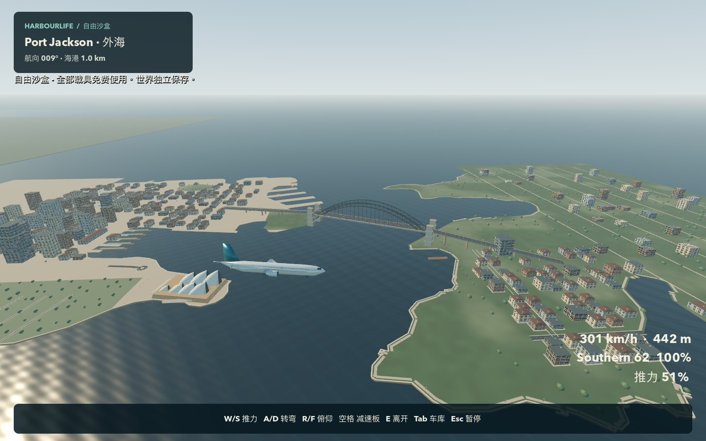
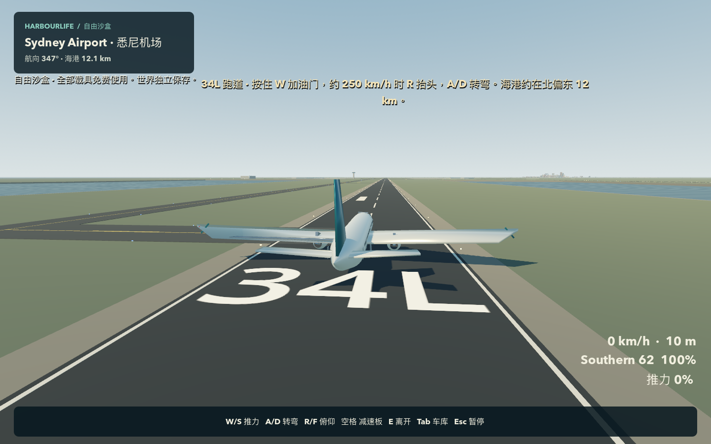

# Harbourlife · 悉尼海港

**[下载 Mac 试玩版](https://github.com/YvesZhou-hub/harbourlife/releases/download/v0.1.0-preview.1/Harbourlife-macOS-arm64.zip)** · [发布页面](https://github.com/YvesZhou-hub/harbourlife/releases/tag/v0.1.0-preview.1) · [实机试飞短片](https://github.com/YvesZhou-hub/harbourlife/releases/download/v0.1.0-preview.1/flight-highlights.mp4)

一个免费的实验性原生单人城市沙盒。从悉尼金斯福德机场起飞，沿连续世界飞向歌剧院和海港大桥，也可以步行、驾车、开船、做活动和进行局部破坏实验。游戏离线运行，不需要账号、浏览器或付费 AI 服务。

当前版本为 **v0.1.0-preview.1**，是可游玩的开发预览，美术、性能和内容仍在完善。下载包面向 **Apple Silicon Mac（M 系列芯片）**；目前只在 **Apple M4 / 16 GB / macOS 26.5** 实测。没有发布 Windows、Intel Mac 或浏览器版本。



## 下载与启动

1. 下载上方的 `Harbourlife-macOS-arm64.zip`，解压得到 `Harbourlife.app`。
2. 可将应用移到“应用程序”文件夹，然后双击打开。游玩不需要下载源码或安装 Godot。
3. 标题页选择 **“从悉尼机场起飞”**，即可建立独立沙盒世界，从机场跑道开始。

应用经过本地 ad-hoc 签名，**没有 Apple Developer ID 签名或公证**。如果 macOS 因开发者无法验证而阻止首次打开，请先确认文件来自本仓库的发布页面且未被篡改；尝试打开后，可依照 [Apple 官方说明](https://support.apple.com/en-au/102445)，在“系统设置 → 隐私与安全”中针对这个应用选择“仍要打开”，再确认“打开”。这只是该应用的单独例外。

GitHub 的绿色 **Code → Download ZIP** 下载的是源码，不是可直接玩的应用。玩家请使用上方的试玩版下载链接。

## 从机场飞到海港

飞机停在 **34L 跑道**，起飞方向略偏西北，海港位于机场北偏东。

1. 按住 **W** 增加推力，在跑道上加速。
2. 约 **250 km/h** 时按 **R** 抬头；离地后松开，按需用 **R / F** 调整俯仰。
3. 用 **A / D** 转弯，参考 HUD 的航向和海港距离；按 **M** 切换地图。
4. **S** 减推力；落地后用 **空格** 制动。

这是为游戏设计的辅助飞行模型。客机需要前进速度，会失速，不能悬停；游戏地理与操纵不能作为现实导航或驾驶依据。



## 操作

| 操作 | 按键 |
| --- | --- |
| 行走 / 驾驶油门与转向 | WASD / 方向键 |
| 观察 | 鼠标 |
| 奔跑 | Shift |
| 跳跃 / 载具制动或空中减速板 | 空格 |
| 交互、进入或离开载具 | E |
| 飞行俯仰 / 直升机升降 | R / F |
| 拿起或放下货物 | G |
| 工作与活动 | J |
| 车库、购买、调用、维修 | Tab |
| 地图 | M |
| 保存游戏截图 | P |
| 保存世界 | F5 |
| 暂停、设置、存档与恢复 | Esc |
| 角色返回个人空间 | Home |

## 可以玩什么

- **连续世界：**海港两岸、歌剧院、大桥道路与步道、Circular Quay、The Rocks、Milsons Point、码头、工作室和车库；机场包含三条原尺度跑道、滑行道、灯光、近似航站楼、塔台与可进入机库。机场至海港间保留简化地形。
- **七类载具：**跑车、摩托车、游艇、滑翔伞、滑翔机、直升机、双发宽体客机。陆、海、空载具使用不同的运动模型；游艇可承载实体货物。
- **五种活动：**摄影漫步、货物回收、码头巡检、空中观察、跨桥计时赛。收入可用于资产购买和维修。
- **世界反馈：**NPC 行走、对话与危险躲避，有限的事故记忆；建筑局部损伤会同时改变可见网格与碰撞。
- **独立世界：**生活与沙盒模式、本地保存、复制、前一次存档恢复，以及角色、货物和建筑修复功能。

## 存档与恢复

存档保存在本机：

```text
~/Library/Application Support/Godot/app_userdata/Harbourlife · 悉尼海港/worlds/
```

每个世界使用独立 JSON，保留前一次成功写入的 `.bak`。游戏约每 60 秒自动保存，**F5** 手动保存，正常退出也会保存；异常中断可能丢失上次保存后的变化。标题或暂停菜单的“存档与恢复”可以继续、复制世界或读取恢复副本。请避免在运行时手工改动存档。

角色、资产、活动进度及重要损伤会随世界保存。按 **P** 生成的截图位于同级 `photos/` 文件夹。游戏不提供云存档。

## 已验证与已知限制

原生构建已完成机场起飞、经过歌剧院与海港大桥、返回同一跑道并停稳的自动试飞，约 **9 分 26 秒、44.37 km、全程无损**。这使用正常游戏输入和物理系统；它不等同于全面人工手飞验收。更多测试范围、环境与证据见 [测试摘要](docs/TESTING.md)。

- 局部破坏测试记录到约 **0.52 秒**的单次停顿，不能保证全场景稳定 60 FPS。
- 人物、地标细节、机场建筑、水面、动画与声音仍明显简化；机场与海港间不是完整悉尼城市复刻。
- NPC、室内与生活内容数量有限；局部破坏不是完整建筑结构倒塌模拟，多小时稳定性尚未完成验证。
- 只有上述 Mac 配置完成实测；其他硬件与系统版本表现未知。
- 歌剧院商业形象和推广使用等权利事项尚未解决。本预览不声称已获相关机构授权，也不代表任何真实机场、运营商或地标机构。

这是免费试玩预览，尚未达到商业成品质量。

## 源码与本地构建

[下载此版本源码](https://github.com/YvesZhou-hub/harbourlife/archive/refs/tags/v0.1.0-preview.1.zip)，或克隆仓库并切换至 `v0.1.0-preview.1`。可维护的程序化建模源码也是本版本的源资产；地理数据与验证脚本保存在 `source/`。

构建需要 macOS、Python 3，以及固定版本的 **Godot 4.7.2** 编辑器和 macOS 导出模板。工具链不存放在 Git 历史中，可任选一种准备方式：

- 下载本次发布的 [Harbourlife-toolchain-macOS.zip](https://github.com/YvesZhou-hub/harbourlife/releases/download/v0.1.0-preview.1/Harbourlife-toolchain-macOS.zip)，在项目根目录解压，保留其中的 `tools/runtime/` 路径。
- 从 [Godot 官方版本档案](https://godotengine.org/download/archive/) 获取 4.7.2 macOS 编辑器及对应导出模板：将编辑器应用内 `Contents/MacOS/Godot` 可执行文件放为 `tools/runtime/godot`，将模板中的 `macos.zip` 放为 `tools/runtime/templates/macos.zip`。

在项目根目录执行：

```sh
chmod +x tools/runtime/godot
./tools/build.sh
```

脚本在本机非 iCloud 暂存目录中构建并进行 ad-hoc 签名和启动检查，输出 `dist/Harbourlife-macOS-arm64.zip`。`dist/Harbourlife.app` 是指向本机生成应用的链接；分享游戏时请使用 ZIP。构建过程不会获得 Apple Developer ID 签名或公证。

独立验证示例：

```sh
./tools/runtime/godot --headless --path game --script ../tools/test_save.gd
./tools/runtime/godot --headless --path game --script ../tools/test_integration.gd
./tools/runtime/godot --headless --path game --script ../tools/test_vehicles.gd
./tools/runtime/godot --headless --path game --script ../source/airport_test.gd
```

## 许可与来源

原创游戏源码和资产保留权利，允许的免费个人试玩范围见 [PLAY_PERMISSION.md](PLAY_PERMISSION.md)。公开源码不代表授予 MIT 或其他无限制开源许可，也不代表授予第三方地标的商业使用权。

Godot 使用 MIT 许可，OSM 派生地理数据适用 ODbL，OurAirports 跑道数据为公共领域；各自条款保持独立。游戏未分发 Google 地图瓦片、航空照片、第三方城市模型或系统字体文件。

[资产与依赖来源](licenses/ASSET_REGISTER.md) · [地理数据许可](licenses/GEOGRAPHY.md) · [海港地理说明](reports/GEOGRAPHY.md) · [机场说明](reports/AIRPORT.md)

## English

Harbourlife is a **free experimental, offline single-player Sydney sandbox**. Take off from Sydney Airport, visit the Opera House and Harbour Bridge, or explore on foot and with seven vehicle types. Download the **Apple Silicon Mac application** from the links above; GitHub's source ZIP is not the playable build.

Tested only on Apple M4, 16 GB RAM, macOS 26.5. The application is ad-hoc signed and **not notarized**. There is no Windows, Intel Mac, or browser release. Art and content remain simplified, and a destruction test showed a 0.52-second stall. Original source and assets are rights-reserved; see [play permission](PLAY_PERMISSION.md) and the separate dependency/data licenses. Commercial landmark clearance remains unresolved.
