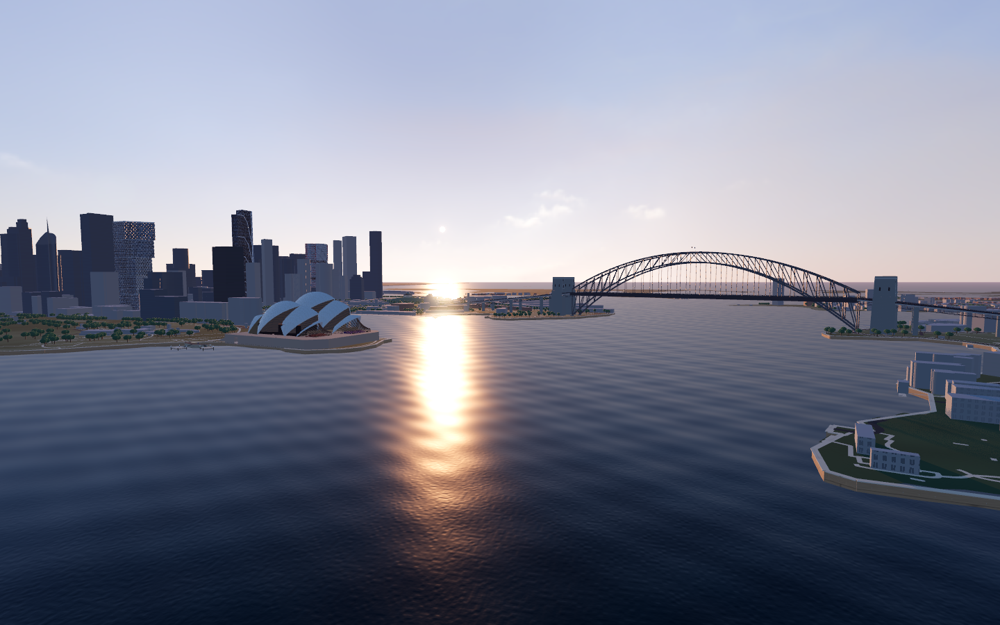
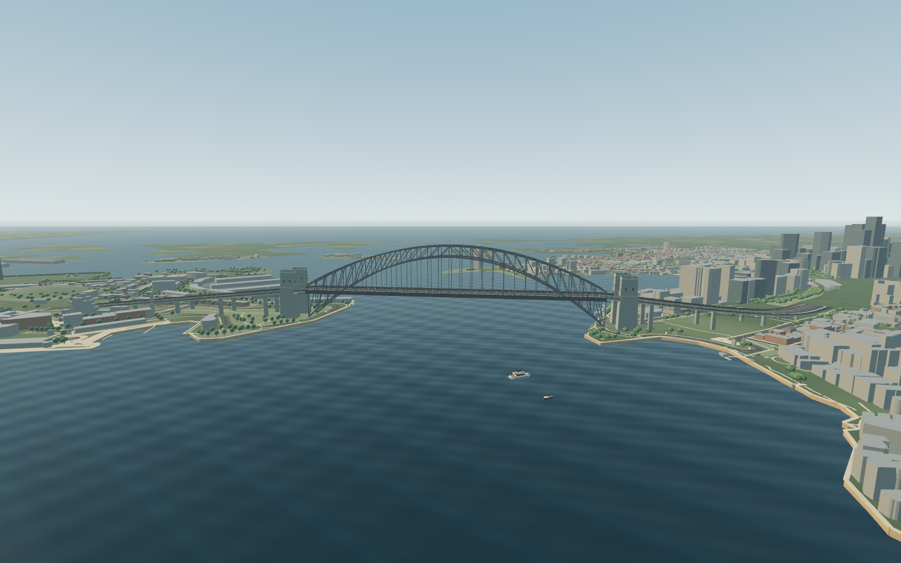

# Harbourlife · 悉尼海港

**v0.1.7-preview.1 · 夏季日夜、公共空间与战斗载具**

[下载 Mac 试玩包](https://github.com/YvesZhou-hub/harbourlife/releases/download/v0.1.7-preview.1/Harbourlife-macOS-arm64.zip) · [所有发布](https://github.com/YvesZhou-hub/harbourlife/releases)

免费的原生单人城市沙盒。从悉尼金斯福德机场起飞，飞向歌剧院和海港大桥；也可以步行、驾车、开船，探索 CBD、Darling Harbour、Darling Square 和 Manly。游戏离线运行，不需要账号或付费服务。

本轮把 106 处有明确地图边界的步行广场改为完整铺面，并同步大小地图；细化 Manly 码头公共大厅、Corso 步行街和 Hotel Steyne 外观，加入 QVB 街侧入口与首层公共通廊。室外和公开室内一起核对实照、入口与通行，具体依据及未完成部分见 [本轮说明](docs/FIXES_0.1.7.md)。歌剧院大台阶实体基座、免费载具与原有内容继续保留。公开试玩包面向 **Apple Silicon Mac（M 系列芯片）**；目前验证环境为 Apple M4 / 16 GB / macOS 26.5，没有 Windows、Intel Mac 或浏览器玩家版本。







## 下载后直接试飞

1. 从发布页面下载 `Harbourlife-macOS-arm64.zip`，解压得到 `Harbourlife.app`，双击打开。游玩不需要源码或 Godot 编辑器。
2. 标题页选择 **“从悉尼机场起飞”**，建立独立沙盒世界，从 **34L 跑道**进入客机。
3. 按住 **W** 加推力，约 **250 km/h** 时按 **R** 抬头；离地后松开，按需用 **R / F** 调整俯仰。
4. **A / D** 转弯，朝北偏东飞向海港；**M** 打开地图选择歌剧院或大桥，跟随距离和方向指引。**S** 减推力，落地后用空格制动。

这是辅助飞行游戏模型：客机需要前进速度，会失速，不能悬停。不要将游戏地图或操纵当作现实导航与驾驶依据。

发布包采用本地 ad-hoc 签名，未取得 Apple Developer ID 签名或公证。首次打开若被 macOS 阻止，请确认来自本仓库发布页面，再按 [Apple 官方说明](https://support.apple.com/en-au/102445)，在“系统设置 → 隐私与安全”中针对该应用选择“仍要打开”。GitHub 的 **Code → Download ZIP** 下载的是源码，不能直接当应用打开。


## 用 M 找城市里的地点

常驻小地图显示当前位置、朝向和目的地方向。按 **M** 打开大地图后角色与载具暂停、鼠标显示，可搜索名称、缩放、拖动，点击地点或任意空白处标点；选点后地图保持打开，右键或清除按钮取消标记。按 **M / Esc** 或右上角 **返回游戏** 继续原来的步行或驾驶。游玩中也可按住 **Alt / Option** 显示鼠标、点击小地图，松开后恢复观察。

默认按悉尼夏季 **12 倍速**循环：现实 2 小时走完游戏一天，日出约 06:02、日落约 20:00。按 **T** 拖动时间或直接跳到日出、正午、金色时刻、日落和夜间，也可以改变速度、定格拍照；所选时间随世界存档。它采用固定夏季天文基准，不同步现实天气，详见 [夏季时间](docs/SUMMER_CLOCK.md)。


地图显示真实岸线、道路与建筑轮廓，导航同时提供屏幕标记、罗盘方向和直线距离，存档后保留目的地。可以搜索已制作的地标、商户、公共设施及离线 OSM 地点目录。选择地点只设置导航，不会传送人物或改变当前载具；室内与楼层仍需要自己寻找入口和楼梯。

- **CBD 与海港：**HSBC 所在的 Tower One、中国银行 140 Sussex Street、Westpac Place、Commonwealth Bank Place South / North、Quay Quarter Tower 与 Salesforce Tower，均有单独制作的外观。
- **歌剧院：**重做不同尺度的两列屋壳、大台阶与公共入口，可进入票务大厅、音乐厅、Joan Sutherland 歌剧厅和北侧海港门厅。包含分层座席、舞台、管风琴、木饰面曲顶、18 枚声学反射板与乐池；仍有估算，未制作全部后台。
- **Darling Harbour / Darling Square：**保留 W Sydney、The Exchange 与海底捞，扩充 23 家定位店面、Exchange 楼栋目录，以及北侧 Darling Quarter 的攀爬网、水上游乐、滑梯、遮阳棚和四处喷泉轮廓。官方 71 条商户记录已分类，部分仍缺可靠位置或外观，具体照片依据及推断范围见 [达令区说明](docs/DARLING_PUBLIC_FACILITIES_REFERENCE.md)。
- **Circular Quay：**Wharf 2–6 按地图位置和不同朝向分别建造，补候船棚、入口标牌和滨水步道，车站独立还原花岗岩外墙、窗带与开放柱廊；Eastbank、Searock 与 City Extra 按实景补做沿街外观。
- **Sydney Tower Eye：**独立塔体、金色观景舱、拉索、窗格、观景平台外形与 Market Street 外部到达点；未提供乘电梯上塔的室内游览。
- **Manly：**可沿码头公共大厅—Corso—Hotel Steyne 连续游览；码头入口、厅内屋架和座椅、酒店雨棚与街侧阳台参考实照，三处饮水设施采用地图节点位置。公共大厅依据含历史照片，未声称现况室内完整还原。[参考与范围](docs/MANLY_REFERENCE.md)
- **QVB：**独立铜穹顶、街侧拱窗与首层 Grand Walk，可从公共街门穿过南北通廊和中央东西通道。以公开保护计划照片与平面图为依据；地下层、上层商铺及室内高差仍未全部制作。[参考与范围](docs/QVB_REFERENCE.md)
- **Metro：**Barangaroo 与 Martin Place 北入口包含街面门厅、下行扶梯和第一层地下落脚区，可实际走下去再返回街道。扶梯静止，没有列车或完整站台运营。

**新增办公楼与 ICC 场馆群：**CyberCX 的 2 Market Street、Cloudflare 的 388 George Street 已单独建模。ICC 的 Convention Centre、Exhibition Centre 与相邻 **TikTok Entertainment Centre** 分为三个独立场馆，可从街面进入已制作的大厅、展厅和观众厅，走上剧场舞台后返回。TikTok 在这里指演出场馆；楼层高差、座位数量及未公开空间仍有简化。[场馆资料与范围](docs/ICC_REFERENCE.md)


## 真实地图与建模精度

当前数据库包含 **15,508 个建筑轮廓或分体记录**；计数包括同一建筑的分体，普通街区使用地图轮廓和推断外立面。其中 524 条记录带已支持的坡屋顶类型，523 个在实际场景中生成，桥头保护区内另 1 个被排除；517 个屋顶升高仍需估算。已列明的地标、银行楼和店面另按真实照片单独制作。106 处明确标注的地面步行广场采用源多边形铺面，避免过去只有边缘路带、中心漏铺的问题。具体覆盖、记录数和参考资料统一见 [城市数据与精度](docs/CITY_DATA.md)。

位置、外形和高度分别记录来源。有公开高度时采用对应资料；仅有层数或照片时明确使用估算。大部分地面仍是平坦游戏基准，山坡、高架和地下网络尚未完整重建；机场至城区的中间地形也保留简化。本项目不声称已完成全悉尼一比一复刻或摄影测量扫描。

## 创造载具与其他玩法

按 **Tab** 选择车型，**每次点击免费新增独立副本并立即进入驾驶位**，之前的载具继续留在原地。不需要下车、找车或解锁。系统检查完整车身、机翼或船体，选择合理的道路、水面或机场位置；附近放不下客机时使用机场空闲位置。没有人为设定副本上限，实际数量受设备性能与可用空间影响。


十一类载具包括超跑、运动摩托、反重力平衡车、豪华快艇、多层游艇、滑翔伞、滑翔机、直升机、大型双发客机、无敌坦克和 2,000 km/h 战斗机。坦克支持鼠标瞄准、炮管俯仰，X 或鼠标左键发射；战机发射前向火箭，两者撞击能破坏建筑构件并保存损坏状态。超跑参考 Revuelto，摩托参考 S 1000 RR，客机采用 787-9 的体量与主要特征，两种船分别参考 Rivamare 与 90 Ocean。模型包含轮胎轮毂、灯组、玻璃、发动机、甲板与座舱细节，采用原创程序化几何，不是厂商 CAD 或照片级扫描。[车辆和飞机参考](docs/VEHICLE_REFERENCE.md) · [新航空模型参考](docs/AIR_VEHICLE_REFERENCE.md) · [船艇参考](docs/BOAT_REFERENCE.md)

**Aether X1 反重力平衡车**是原创科幻载具：W/S 加速或后退，A/D 转向，空格急停；R/F 提升或降低悬浮高度，松开后保持。它自动越过台阶并掠水行驶，不消耗燃料；遇到无法越过的实体墙会辅助制动。

| 载具 | 本版游戏极速 |
| --- | ---: |
| 超跑 | 420 km/h |
| 摩托车 | 320 km/h |
| 反重力平衡车 | 200 km/h |
| 客机 | 800 km/h |
| 直升机 | 350 km/h |

上述速度为游戏调校。滑翔机和滑翔伞没有发动机，创建后以安全高度与滑翔初速进入，松开操纵仍会缓慢下降；A/D 转向、R/F 调整俯仰、空格减速。

两种模式都从 **$50,000** 开始。旧世界首次更新时仅补足不足部分，花掉后不会反复补款。摄影、回收、巡检、飞行观察和竞速均可重复，基础报酬 $1,500–3,000。**K** 打开城市体验：Darling Square 与环形码头已制作店面的美食、ICC 场馆纪念体验和 Manly 野餐共 22 项，每次 $12–120，恢复耐力并保存旅行印章。这些是游戏消费反馈；目前没有实际电影播放、完整演出或全部商铺室内。[资金与体验说明](docs/PLAY_EXPERIENCE.md)

NPC 有行走、对话和危险躲避；局部建筑损伤同时改变画面与碰撞，并随世界保存。室内、活动和 NPC 内容仍有限，破坏系统不等同于现实建筑倒塌模拟。

## 操作

| 操作 | 按键 |
| --- | --- |
| 行走、油门与转向 | WASD / 方向键 |
| 观察 | 鼠标 |
| 奔跑 | Shift |
| 跳跃、载具制动 / 减速板 | 空格 |
| 交互、进入 / 离开载具 | E |
| 飞行俯仰、直升机 / 平衡车升降 | R / F |
| 货物 | G |
| 工作与活动 | J |
| 城市体验、美食与旅行印章 | K |
| 免费新增载具、立即驾驶与维修 | Tab |
| 打开 / 关闭地图与目的地 | M |
| 时间、日出晚霞、循环速度与定格 | T |
| 运行诊断与实时画面参数 | F3 |
| 坦克 / 战机发射 | X / 左键 |
| 坦克炮塔左右 / 炮管上下 | Q / Z、R / F |
| 临时显示鼠标、点击小地图 | 按住 Alt / Option |
| 保存截图 / 保存世界 | P / F5 |
| 暂停、设置、存档与恢复 | Esc |
| 角色返回个人空间 | Home |

## 存档与旧世界

存档位于本机 `~/Library/Application Support/Godot/app_userdata/Harbourlife · 悉尼海港/worlds/`。每个世界使用独立 JSON，保留前一次成功保存的 `.bak`；约每 60 秒自动保存，F5 手动保存，正常退出也会保存。截图存于同级 `photos/`，没有云存档。

本版写入存档格式 5，仍可读取旧格式 1 / 2 / 3 / 4，保存独立载具、导航目标和城市体验。较大的新船艇会检查旧泊位净空，必要时调整静止旧副本；原有 ID、油量和损伤保留，空中姿态与安全桥下停车不会被搬到另一层道路。旧世界首次进入本次地图时，会检查人物和已有载具是否被新建筑包住，只调整发生冲突的副本，保留 ID、油量、损伤与占用关系；之后正常保存记录地图版本。详见 [旧地图存档迁移](docs/SAVE_MAP_MIGRATION.md)。格式 5 存档须继续使用本版或兼容的新版应用；v0.1.2 会拒绝读取，防止旧版忽略滑板等新内容后覆盖保存。仅载入旧存档不会重写原文件；首次成功保存时升级格式并保留之前的恢复副本。

## 验证与已知限制

最终发布构建、原生应用内自动验证、镜头跟随、静态渲染采样和试飞结果，以 [本轮验证记录](docs/TESTING.md) 对应的构建和证据为准。初版试飞视频及旧性能数据不作为这次城市扩展的通过证明。具体通过数量、启动方式和试飞范围列在验证记录中。

仅上述 Mac 配置有实测记录，其他设备表现未知。还没有多小时稳定性或完整硬件矩阵验证，不能保证所有场景稳定 60 FPS。游戏、美术、声音和生活内容仍是开发预览；商业推广所需的第三方地标形象等权利也尚未全部解决。

## 源码与本地构建

[仓库源码](https://github.com/YvesZhou-hub/harbourlife)保留程序化建模源资产、地图快照和验证脚本；本轮使用 `v0.1.7-preview.1` 标签对应的源码。

构建需要 macOS、Python 3，以及 [Godot 官方 4.7.2-stable 编辑器与 macOS 导出模板](https://github.com/godotengine/godot-builds/releases/tag/4.7.2-stable)。将编辑器应用内 `Contents/MacOS/Godot` 放为 `tools/runtime/godot`，导出模板 `macos.zip` 放为 `tools/runtime/templates/macos.zip`，保持两者版本一致，再运行：

```sh
chmod +x tools/runtime/godot
codesign --force --sign - tools/runtime/godot
./tools/build.sh
```

脚本使用本机暂存目录构建、ad-hoc 签名和启动检查，输出 `dist/Harbourlife-macOS-arm64.zip`。`dist/Harbourlife.app` 是本地生成应用的链接，分享请用 ZIP。地图的离线重建步骤见 [CITY_DATA.md](docs/CITY_DATA.md)，验证命令见 [TESTING.md](docs/TESTING.md)。

## 许可与来源

原创源码和资产保留权利，免费个人试玩范围见 [PLAY_PERMISSION.md](PLAY_PERMISSION.md)。公开源码不代表 MIT 授权，也不授予第三方地标的商业使用权。

Godot 适用 MIT，OSM 派生地理数据适用 ODbL，OurAirports 跑道数据为公共领域，各自条款独立。没有分发 Google 地图瓦片、街景照片或第三方城市模型。

[资产与依赖来源](licenses/ASSET_REGISTER.md) · [地理数据许可](licenses/GEOGRAPHY.md) · [城市精度与参考](docs/CITY_DATA.md) · [机场说明](reports/AIRPORT.md)

## English

Harbourlife is a free, offline, single-player Sydney sandbox for **Apple Silicon Mac**. Start on runway 34L at Sydney Airport, fly to the Opera House and Harbour Bridge, or explore the mapped CBD, Darling Harbour and Manly. Press **M** for destinations and **Tab** to create independent vehicle copies.

**v0.1.7-preview.1 · Public spaces and connected visits.** This update renders 106 explicitly mapped pedestrian areas as filled polygons in the city and both maps; improves the Manly wharf public concourse, Corso street furniture and Hotel Steyne exterior; and adds QVB's publicly accessible ground-floor arcade with photo-informed facades and domes. Map revision 7 checks legacy occupied poses while retaining old damage IDs. Official terrain reference extraction is documented separately and is not yet a replacement for the flat game terrain. This remains an original reconstruction with estimated details, not a complete 1:1 city scan. The Apple Silicon app is ad-hoc signed and not notarized. Final build-specific results are in [TESTING.md](docs/TESTING.md); exact sources and limits are in [the update notes](docs/FIXES_0.1.7.md).
