# Harbourlife · 悉尼海港

[](https://github.com/YvesZhou-hub/GTA-6-Sydney/actions/workflows/pr-checks.yml) · [每个 PR 自动跑的检查](docs/AUTOMATED_CHECKS.md)

**v0.5.0-preview.1 · 战斗手感、奶龙新节奏与港区限时求助**

[下载 Windows x86_64 试玩包](https://github.com/YvesZhou-hub/GTA-6-Sydney/releases/download/v0.5.0-preview.1/Harbourlife-Windows-x86_64.zip) · [下载 Mac 试玩包](https://github.com/YvesZhou-hub/GTA-6-Sydney/releases/download/v0.5.0-preview.1/Harbourlife-macOS-arm64.zip) · [所有发布](https://github.com/YvesZhou-hub/GTA-6-Sydney/releases)

免费的原生单人城市沙盒。从悉尼金斯福德机场起飞，飞向歌剧院和海港大桥；也可以步行、驾车、开船，探索 CBD、Darling Harbour、Darling Square 和 Manly。游戏离线运行，不需要账号或付费服务。

**v0.5.0 新内容：** 战斗有了手感：开枪有后坐，挨打时镜头会抖、准星旁的红色弧线指出攻击方向，血量低时屏幕四边变红，打中的奶龙会被击退。奶龙出手分成「预警 → 出手 → 收招」三段，喷吐奶龙三连发、首领和雷翼奶龙连打两下，出手后的僵直是你还手的机会；新敌人**跳袭奶龙**会蹲下蓄力再扑过来，蓄力时走开就能躲。设置里新增**战斗难度**（轻松 / 标准 / 硬核）。港区会发出**限时求助**：3 分钟内打退围攻或巡查 3 个点，完成得 $3,000 和清剿进度。[本版改动](docs/FIXES_0.5.0.md) · [战斗手感与难度](docs/COMBAT_FEEL.md) · [港区限时求助](docs/DISTRICTS.md#限时求助事件)

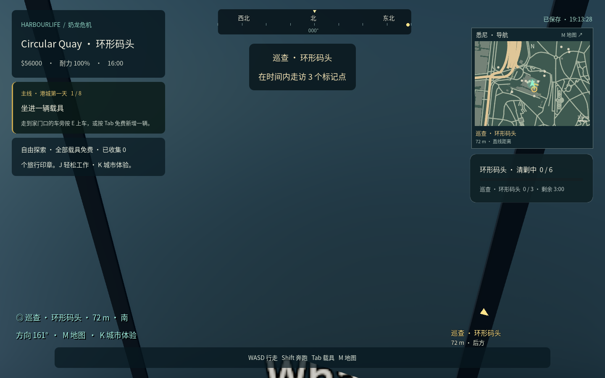

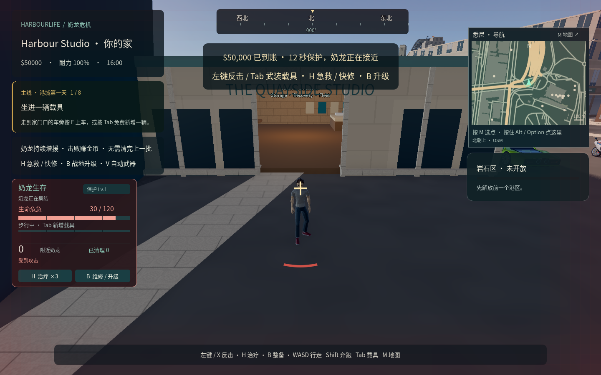

**v0.4.0 新内容：** 主角和居民换成带动作的人物模型；街上有按真实路网行驶的车流和走在人行道上的行人（可在设置里调节或关闭）；树、路灯、长椅和信号灯让街道不再空旷；市区地面是铺装、公园是草地，夜里路灯会亮。玩法上新增**夺回港区**：九个港区被奶龙占据，在港区里打奶龙或完成工作、城市体验就能把它夺回来，解放后街上的人车明显变多，并开放下一个港区。[本版改动](docs/FIXES_0.4.0.md) · [港区解放](docs/DISTRICTS.md) · [街上的车流与行人](docs/STREET_LIFE.md)

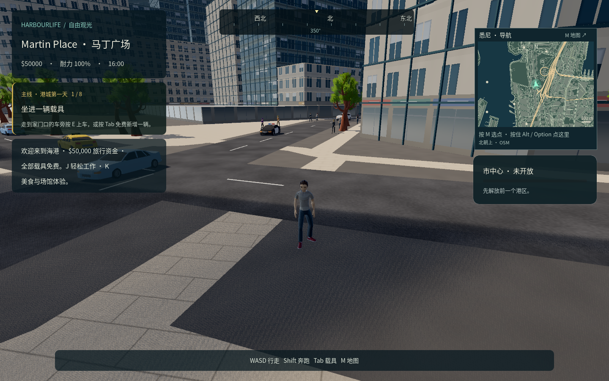

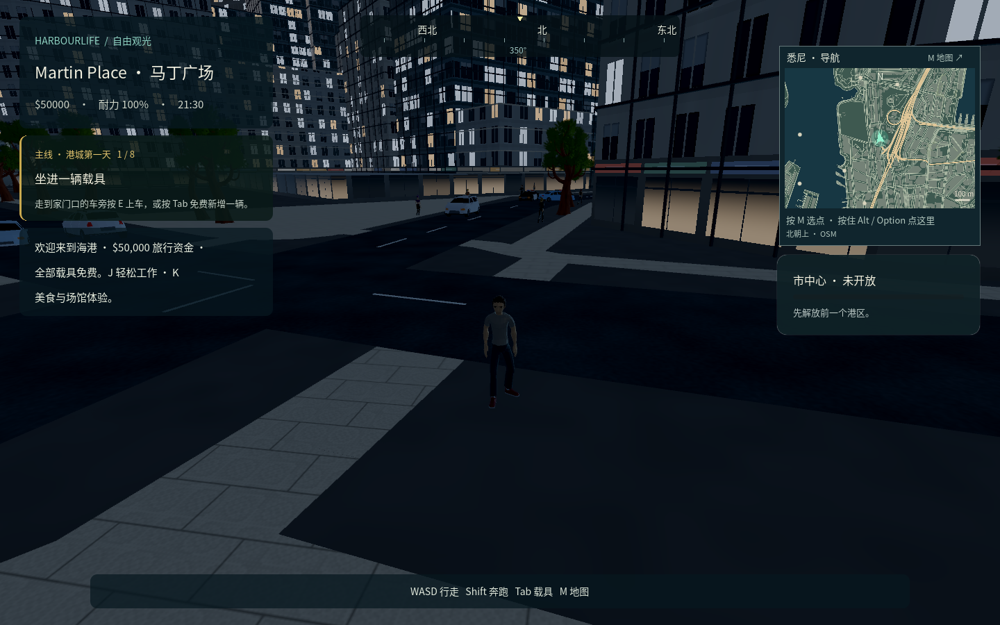

**v0.3.0 新内容：** 新世界自动开始主线第一章“港城第一天”，8 步带导航和奖励，另有 15 个本机成就；完整设置菜单（显示模式、帧率、渲染分辨率、抗锯齿、视野）、手柄支持与键盘改键，提示文字会跟着键位变化；光照、临街店面、树木草坪和路面全面翻新；加载从约 74 秒降到约 13 秒，并有进度条、不再“未响应”。[本版改动](docs/FIXES_0.3.0.md) · [主线与成就](docs/CAMPAIGN_AND_ACHIEVEMENTS.md) · [设置与手柄](docs/SETTINGS_AND_CONTROLS.md)

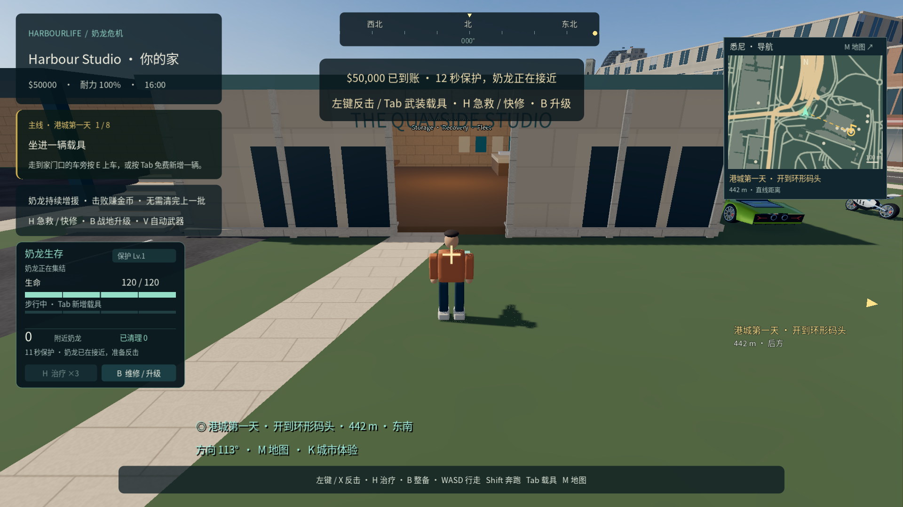

**奶龙危机**跟随玩家所在街区持续增援，加入俯冲与雷击两类空中奶龙。清晰血条和伤害浮字显示每只敌人实际扣掉多少血；炮弹中心伤害更高，边缘较低。11 类载具保留免费自动副武器，还可花金币选装机关枪、微型范围炮、激光与连锁闪电。每种车型三个额外槽位，模块各三级，免费拆装并保留等级；V 控制自动武器，X 手动开火，B 选装升级，H 急救或战地快修。保留无敌人的自由观光模式，以及漂移、急刹和 Shift 三倍加速。[生存规则](docs/SURVIVAL_DESIGN.md) · [驾驶操作](docs/DRIVING.md) · [武器选装](docs/FIXES_0.2.2.md)。试玩包面向 **Windows x86_64（Intel / AMD 64 位）** 与 **Apple Silicon Mac（M 系列芯片）**，离线游玩免费。[Windows 启动说明](docs/WINDOWS.md)

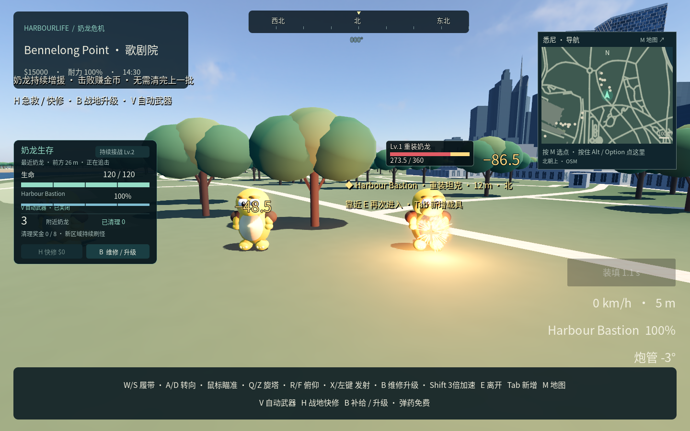

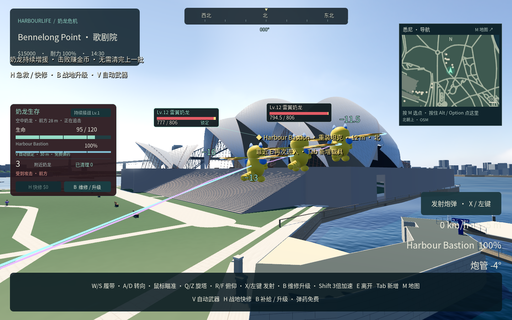

以下宣传素材录制于 v0.1.8：

[观看 38 秒横屏宣传片](https://github.com/YvesZhou-hub/harbourlife/releases/download/v0.1.8-preview.1/Harbourlife-Sydney-Trailer-1080p.mp4) · [16.5 秒短版](https://github.com/YvesZhou-hub/harbourlife/releases/download/v0.1.8-preview.1/Harbourlife-Sydney-Teaser-1080p.mp4) · [下载宣传素材包](https://github.com/YvesZhou-hub/harbourlife/releases/download/v0.1.8-preview.1/Harbourlife-Promo-Kit.zip)

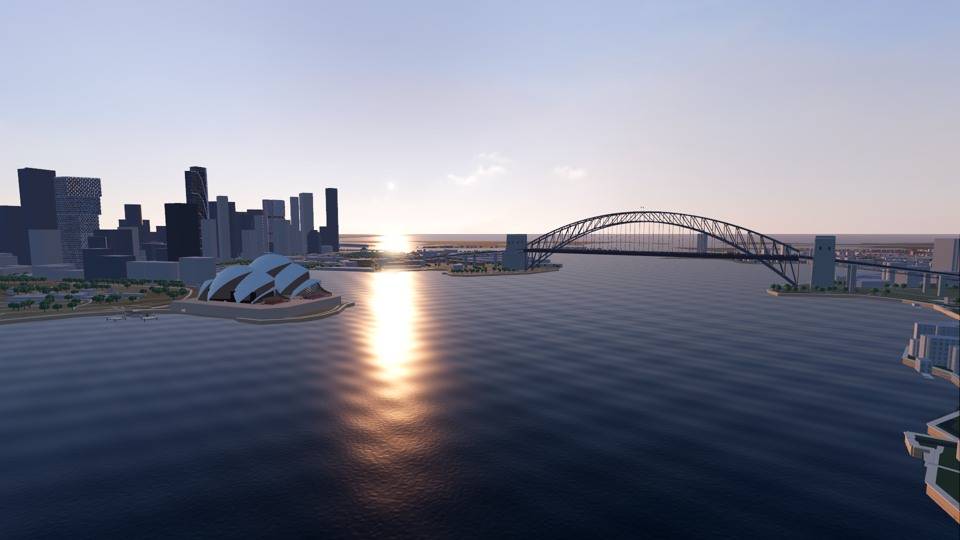


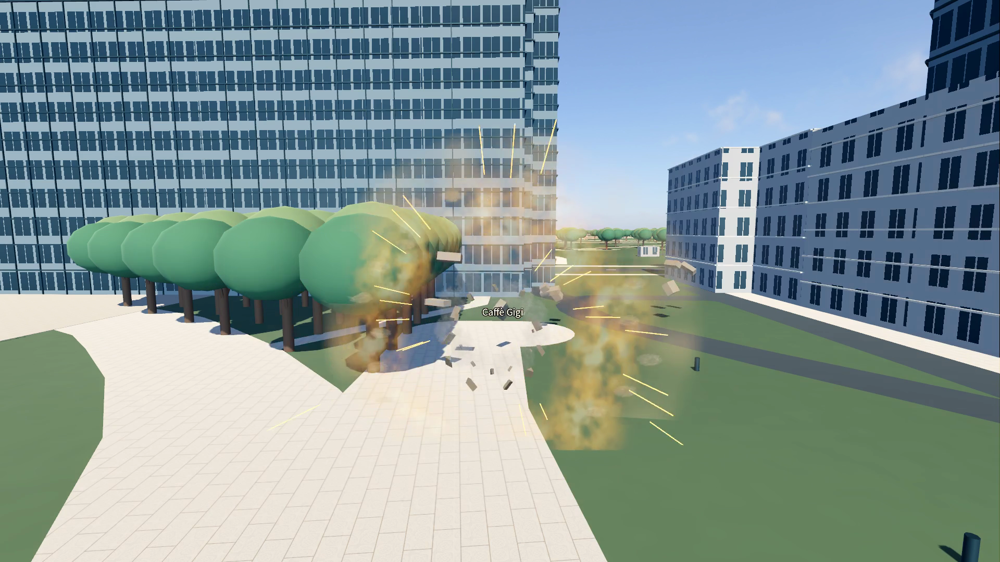

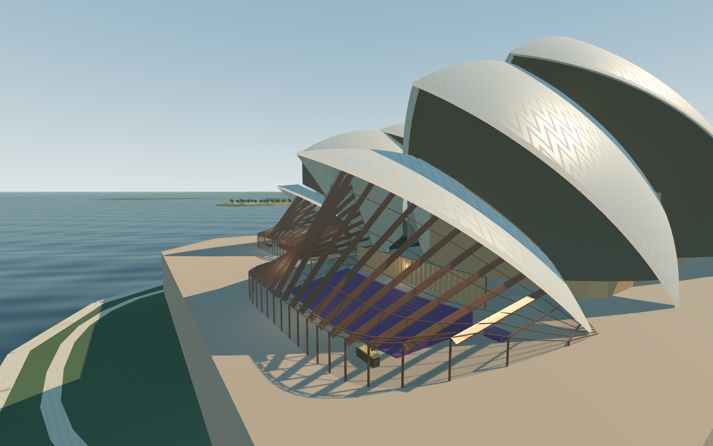

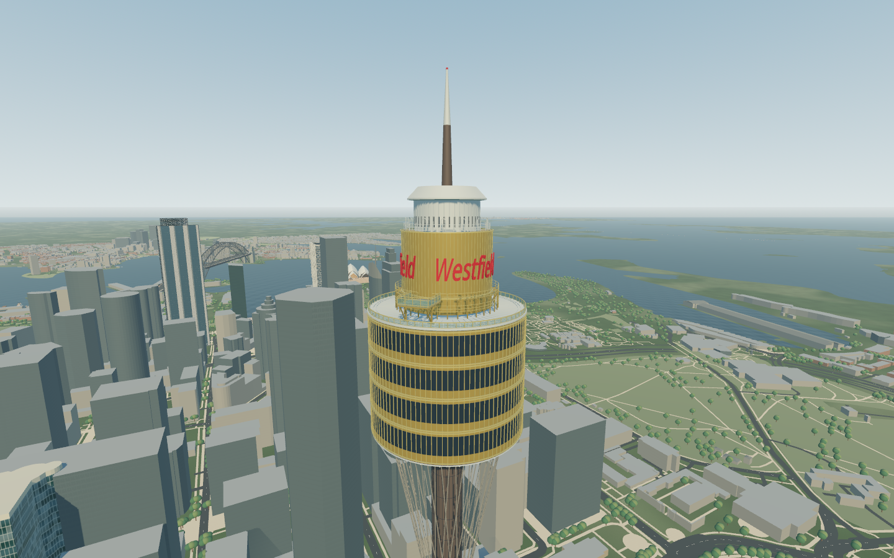

## 奶龙危机怎么玩

选择“奶龙危机 · 开始生存”：地面奶龙从附近可行走区域自动出现并追击，轻翼奶龙从空中俯冲，高等级雷翼奶龙释放可躲避的落雷；开局 12 秒保护期间敌人就会接近。左键或 X 反击，Tab 免费进入武装载具；副武器默认自动锁定和发射，V 随时开关。换街区不必清完旧敌人；清理进度决定奖金和基础难度，装备也会逐步影响新增敌人的等级，最高 Lv.30；健康状态下装备带来的压力每 18 秒最多提高一级，低血量时暂停提升。购买升级不会给已经出现的敌人加血。

H 在步行时使用医疗包恢复 60 生命；驾驶时花金币快修最多 25% 耐久，两者各有 12 秒冷却。B 打开战地整备暂停战斗，附近有敌人也能补给、升级或快修；停稳并脱战后可进行更便宜的完整维修。

坦克与战机可升级火控三次，实际增加爆炸范围、伤害和射速；弹药始终免费。坦克三级火控的爆炸半径为 25.6 米，装填时间为 0.805 秒。车辆耐久归零会失去动力，E 离舱或 Home 呼叫救援；救援保留升级，收费不超过现有余额。此模式没有基地建设。仍可选择“自由观光 · 无敌人”安静游览。

v0.2.2 使用存档格式 7，保存武器所有权、装配和成长进度；可读取格式 1–6 的旧存档。新存档不能回退到 v0.2.1 或更早版本读取，请保留更新前的存档备份。完整价格、武器差异和操作见 [武器选装说明](docs/ARSENAL.md)。

## 下载后直接试飞

1. 从发布页面选择自己的平台：**Windows** 下载 `Harbourlife-Windows-x86_64.zip`，选择“全部解压缩”，进入 `Harbourlife` 文件夹运行 `Harbourlife.exe`，保留旁边的 PCK 和其他随包文件；**Mac** 下载 `Harbourlife-macOS-arm64.zip`，解压后双击 `Harbourlife.app`。游玩不需要源码或 Godot 编辑器。
2. 标题页选择 **“机场出发 · 奶龙危机”**，建立独立生存世界，从 **34L 跑道**进入客机。
3. 按住 **W** 加推力，约 **250 km/h** 时按 **R** 抬头；离地后松开，按需用 **R / F** 调整俯仰。
4. **A / D** 转弯，朝北偏东飞向海港；**M** 打开地图选择歌剧院或大桥，跟随距离和方向指引。**S** 减推力，落地后用空格制动。

这是辅助飞行游戏模型：客机需要前进速度，会失速，不能悬停。不要将游戏地图或操纵当作现实导航与驾驶依据。

Mac 发布包采用本地 ad-hoc 签名，未取得 Apple Developer ID 签名或公证。首次打开若被 macOS 阻止，请确认来自本仓库发布页面，再按 [Apple 官方说明](https://support.apple.com/en-au/102445)，在“系统设置 → 隐私与安全”中针对该应用选择“仍要打开”。Windows 文件与系统要求见 [Windows 说明](docs/WINDOWS.md)。GitHub 的 **Code → Download ZIP** 下载的是源码，不能直接当应用打开。

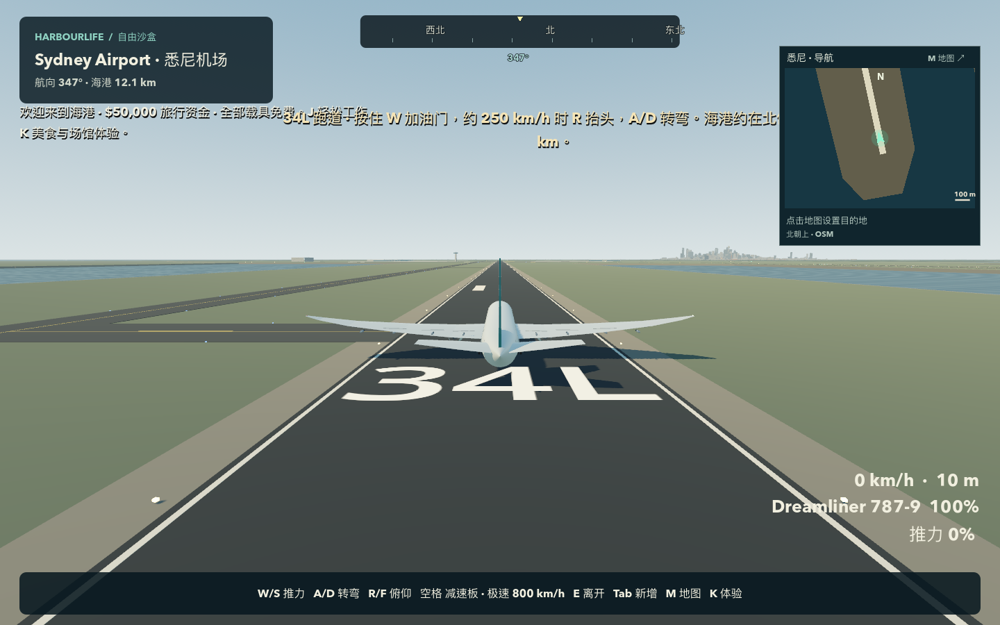

## 用 M 找城市里的地点

常驻小地图显示当前位置、朝向和目的地方向。按 **M** 打开大地图后角色与载具暂停、鼠标显示，可搜索名称、缩放、拖动，点击地点或任意空白处标点；选点后地图保持打开，右键或清除按钮取消标记。按 **M / Esc** 或右上角 **返回游戏** 继续原来的步行或驾驶。游玩中也可按住 **Alt / Option** 显示鼠标、点击小地图，松开后恢复观察。

默认按悉尼夏季 **12 倍速**循环：现实 2 小时走完游戏一天，日出约 06:02、日落约 20:00。按 **T** 拖动时间或直接跳到日出、正午、金色时刻、日落和夜间，也可以改变速度、定格拍照；所选时间随世界存档。它采用固定夏季天文基准，不同步现实天气，详见 [夏季时间](docs/SUMMER_CLOCK.md)。

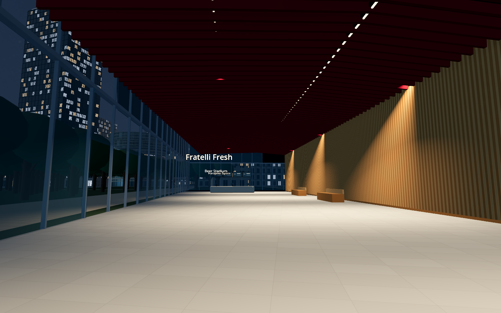

地图显示真实岸线、道路与建筑轮廓，导航同时提供屏幕标记、罗盘方向和直线距离，存档后保留目的地。可以搜索已制作的地标、商户、公共设施及离线 OSM 地点目录。选择地点只设置导航，不会传送人物或改变当前载具；室内与楼层仍需要自己寻找入口和楼梯。

- **CBD 与海港：**HSBC 所在的 Tower One、中国银行 140 Sussex Street、Westpac Place、Commonwealth Bank Place South / North、Quay Quarter Tower 与 Salesforce Tower，均有单独制作的外观。
- **歌剧院：**重做不同尺度的两列屋壳、大台阶与公共入口，可进入票务大厅、音乐厅、Joan Sutherland 歌剧厅和北侧海港门厅。包含分层座席、舞台、管风琴、木饰面曲顶、18 枚声学反射板与乐池；仍有估算，未制作全部后台。
- **Darling Harbour / Darling Square：**保留 W Sydney、The Exchange 与海底捞，扩充 23 家定位店面、Exchange 楼栋目录，以及北侧 Darling Quarter 的攀爬网、水上游乐、滑梯、遮阳棚和四处喷泉轮廓。官方 71 条商户记录已分类，部分仍缺可靠位置或外观，具体照片依据及推断范围见 [达令区说明](docs/DARLING_PUBLIC_FACILITIES_REFERENCE.md)。
- **Circular Quay：**Wharf 2–6 按地图位置和不同朝向分别建造，补候船棚、入口标牌和滨水步道，车站独立还原花岗岩外墙、窗带与开放柱廊；Eastbank、Searock 与 City Extra 按实景补做沿街外观。
- **Sydney Tower Eye：**独立塔体、金色观景舱、拉索、窗格、观景平台外形与 Market Street 外部到达点；未提供乘电梯上塔的室内游览。
- **Manly：**可沿码头公共大厅—Corso—Hotel Steyne 连续游览；码头入口、厅内屋架和座椅、酒店雨棚与街侧阳台参考实照，三处饮水设施采用地图节点位置。公共大厅依据含历史照片，未声称现况室内完整还原。[参考与范围](docs/MANLY_REFERENCE.md)
- **QVB：**独立铜穹顶、街侧拱窗与首层 Grand Walk，可从公共街门穿过南北通廊和中央东西通道。以公开保护计划照片与平面图为依据；地下层、上层商铺及室内高差仍未全部制作。[参考与范围](docs/QVB_REFERENCE.md)
- **Metro：**Barangaroo 与 Martin Place 北入口包含街面门厅、下行扶梯和第一层地下落脚区，可实际走下去再返回街道。扶梯静止，没有列车或完整站台运营。

**新增办公楼与 ICC 场馆群：**CyberCX 的 2 Market Street、Cloudflare 的 388 George Street 已单独建模。ICC 的 Convention Centre、Exhibition Centre 与相邻 **TikTok Entertainment Centre** 分为三个独立场馆，可从街面进入已制作的大厅、展厅和观众厅，走上剧场舞台后返回。TikTok 在这里指演出场馆；楼层高差、座位数量及未公开空间仍有简化。[场馆资料与范围](docs/ICC_REFERENCE.md)

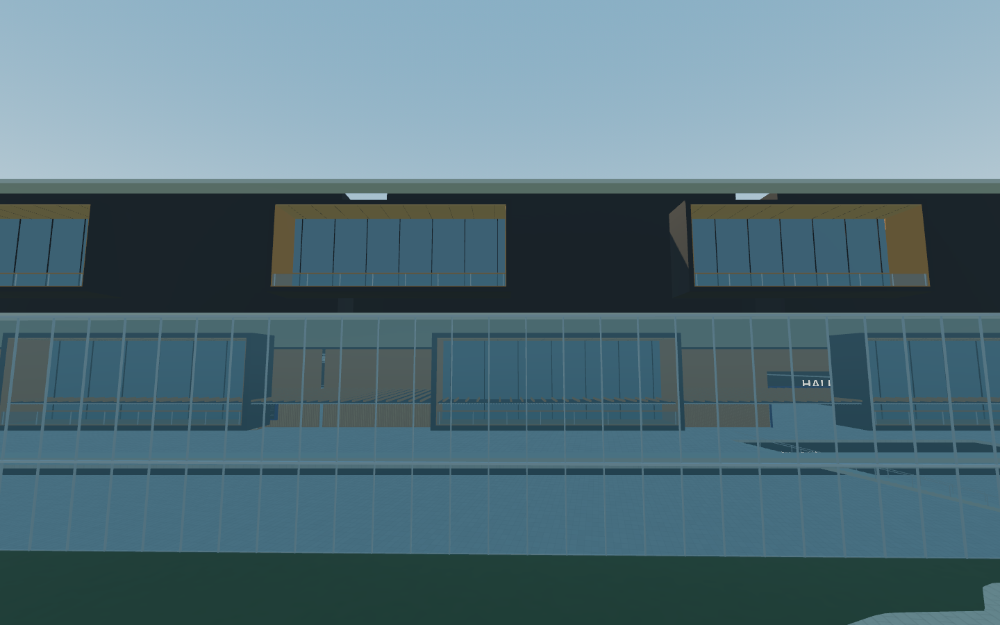

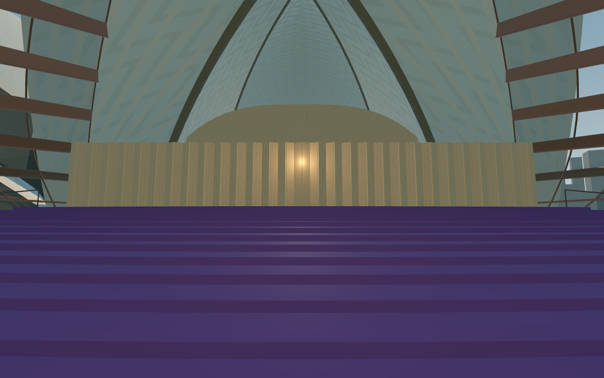

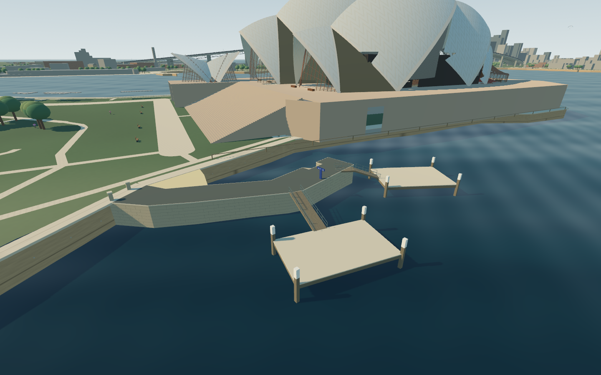

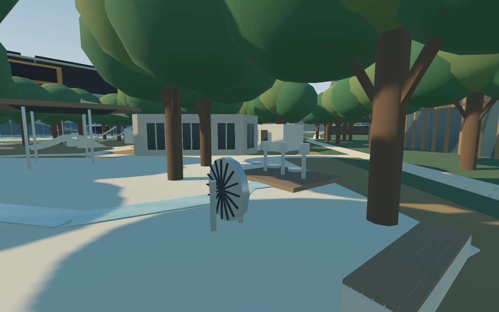

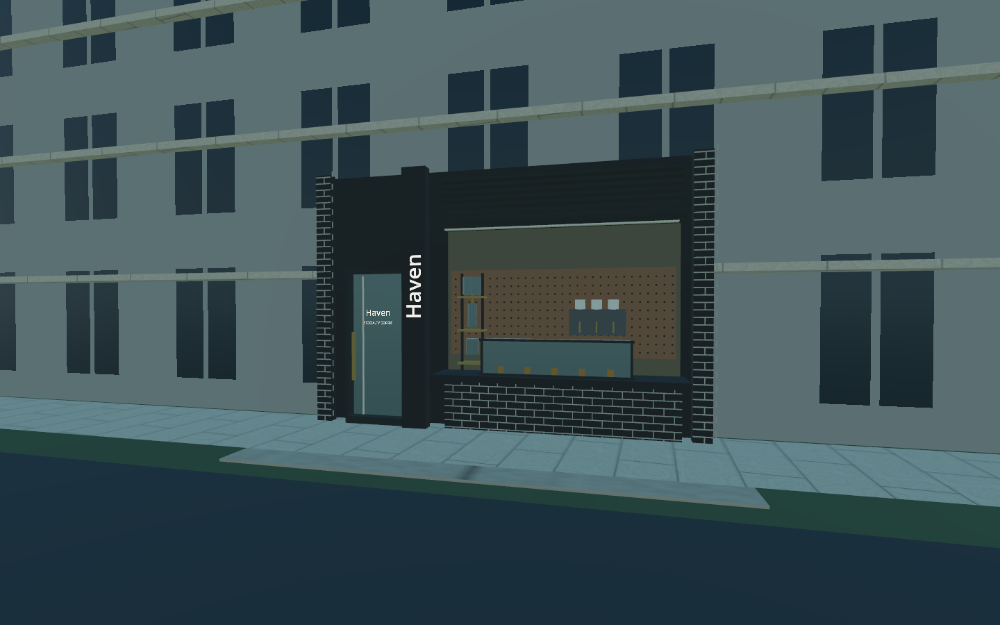

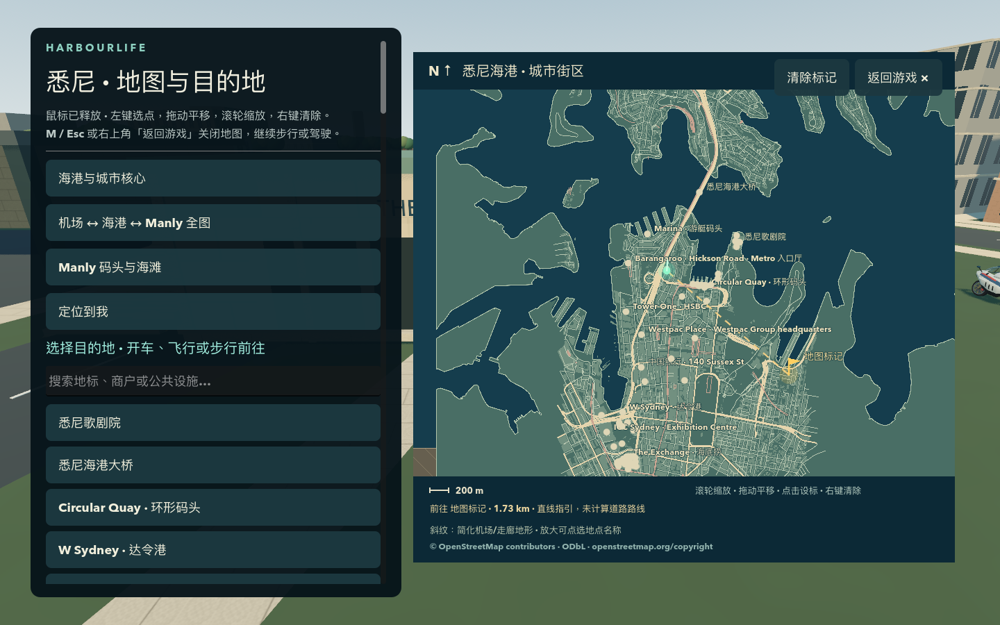

## 真实地图与建模精度

当前数据库包含 **15,508 个建筑轮廓或分体记录**；计数包括同一建筑的分体，普通街区使用地图轮廓和推断外立面。其中 524 条记录带已支持的坡屋顶类型，523 个在实际场景中生成，桥头保护区内另 1 个被排除；517 个屋顶升高仍需估算。已列明的地标、银行楼和店面另按真实照片单独制作。106 处明确标注的地面步行广场采用源多边形铺面，避免过去只有边缘路带、中心漏铺的问题。具体覆盖、记录数和参考资料统一见 [城市数据与精度](docs/CITY_DATA.md)。

位置、外形和高度分别记录来源。有公开高度时采用对应资料；仅有层数或照片时明确使用估算。大部分地面仍是平坦游戏基准，山坡、高架和地下网络尚未完整重建；机场至城区的中间地形也保留简化。本项目不声称已完成全悉尼一比一复刻或摄影测量扫描。

## 创造载具与其他玩法

按 **Tab** 选择车型，**每次点击免费新增独立副本并立即进入驾驶位**，之前的载具继续留在原地。不需要下车、找车或解锁。系统检查完整车身、机翼或船体，选择合理的道路、水面或机场位置；附近放不下客机时使用机场空闲位置。没有人为设定副本上限，实际数量受设备性能与可用空间影响。当前版本同款载具共享耐久、火控升级与选装武器，新增副本继承损伤；车型损毁后按 B 远程维修再出发。

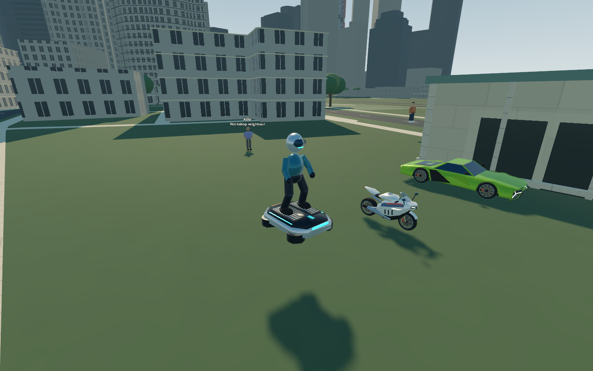

十一类载具包括超跑、运动摩托、反重力平衡车、豪华快艇、多层游艇、滑翔伞、滑翔机、直升机、大型双发客机、重装坦克和 2,000 km/h 战斗机。坦克支持鼠标瞄准、炮管俯仰，X 或鼠标左键发射；战机发射前向火箭，两者撞击能破坏建筑构件并保存损坏状态。超跑参考 Revuelto，摩托参考 S 1000 RR，客机采用 787-9 的体量与主要特征，两种船分别参考 Rivamare 与 90 Ocean。模型包含轮胎轮毂、灯组、玻璃、发动机、甲板与座舱细节，采用原创程序化几何，不是厂商 CAD 或照片级扫描。[车辆和飞机参考](docs/VEHICLE_REFERENCE.md) · [新航空模型参考](docs/AIR_VEHICLE_REFERENCE.md) · [船艇参考](docs/BOAT_REFERENCE.md)

**Aether X1 反重力平衡车**是原创科幻载具：W/S 加速或后退，A/D 转向，空格急停；R/F 提升或降低悬浮高度，松开后保持。它自动越过台阶并掠水行驶，能源可在 B 菜单补充；遇到无法越过的实体墙会辅助制动。

| 载具 | 常规速度上限 | Shift 加速上限 |
| --- | ---: | ---: |
| 超跑 | 420 km/h | 1260 km/h |
| 摩托车 | 320 km/h | 960 km/h |
| 反重力平衡车 | 200 km/h | 600 km/h |
| 客机 | 800 km/h | 2400 km/h |
| 直升机 | 350 km/h | 1050 km/h |
| 战斗机 | 2000 km/h | 6000 km/h |
| 坦克 | 110 km/h | 330 km/h |

上述速度为游戏调校。按住 Shift 逐渐加速，松开后平顺回落。滑翔机和滑翔伞通常无动力，创建后以安全高度与滑翔初速进入，松开操纵仍会缓慢下降；A/D 转向、R/F 调整俯仰、空格减速，Shift 提供游戏辅助推力。船艇和滑翔类的加速基准见 [驾驶说明](docs/DRIVING.md)。

两种模式都从 **$50,000** 开始。旧世界首次更新时仅补足不足部分，花掉后不会反复补款。摄影、回收、巡检、飞行观察和竞速均可重复，基础报酬 $1,500–3,000。**K** 打开城市体验：Darling Square 与环形码头已制作店面的美食、ICC 场馆纪念体验和 Manly 野餐共 22 项，每次 $12–120，恢复耐力并保存旅行印章。这些是游戏消费反馈；目前没有实际电影播放、完整演出或全部商铺室内。[资金与体验说明](docs/PLAY_EXPERIENCE.md)

NPC 有行走、对话和危险躲避；局部建筑损伤同时改变画面与碰撞，并随世界保存。室内、活动和 NPC 内容仍有限，破坏系统不等同于现实建筑倒塌模拟。

## 主线与成就

新世界自动开始主线第一章 **港城第一天**：上车、开到环形码头、给歌剧院拍照、完成一份工作、驾车过海港大桥、飞或开船去曼利、品尝城市美食、击败 5 只奶龙。每步自动导航并发放奖励，全章完成额外 $20,000。左侧卡片显示当前目标与距离；Esc → 目标与成就可查看进度、跳过步骤、隐藏追踪或重新开始（奖励不重复发放）。15 个成就保存在本机、所有世界共享。[主线与成就说明](docs/CAMPAIGN_AND_ACHIEVEMENTS.md)

## 操作

| 操作 | 按键 |
| --- | --- |
| 行走、油门与转向 | WASD / 方向键 |
| 观察 | 鼠标 |
| 步行脉冲枪、坦克 / 战机开火 | 左键 / X |
| 步行急救 / 驾驶战地快修 | H |
| 自动追踪副武器开关 | V |
| 战地整备、补给与火控升级 | B |
| 步行奔跑；载具三倍加速 | 按住 Shift |
| 跑车 / 摩托车漂移 | Ctrl + A / D |
| 跳跃、载具制动 / 减速板 | 空格 |
| 交互、进入 / 离开载具 | E |
| 飞行俯仰、直升机 / 平衡车升降 | R / F |
| 货物 | G |
| 工作与活动 | J |
| 城市体验、美食与旅行印章 | K |
| 免费新增载具、立即驾驶与维修 | Tab |
| 打开 / 关闭地图与目的地 | M |
| 时间、日出晚霞、循环速度与定格 | T |
| 运行诊断与实时画面参数 | F3 |
| 坦克 / 战机发射 | X / 左键 |
| 坦克炮塔左右 / 炮管上下 | Q / Z、R / F |
| 临时显示鼠标、点击小地图 | 按住 Alt / Option |
| 保存截图 / 保存世界 | P / F5 |
| 暂停、目标与成就、设置、存档与恢复 | Esc |
| 角色返回个人空间 | Home |

## 存档与旧世界

Mac 存档位于 `~/Library/Application Support/Godot/app_userdata/Harbourlife · 悉尼海港/worlds/`；Windows 存档位于 `%APPDATA%\Godot\app_userdata\Harbourlife · 悉尼海港\worlds\`。每个世界使用独立 JSON，保留前一次成功保存的 `.bak`；约每 60 秒自动保存，F5 手动保存，正常退出也会保存。截图存于同级 `photos` 文件夹，没有云存档。

本版使用存档格式 7，可读取旧格式 1–6，保存独立载具、导航、城市体验、生存进度及选装武器。较大的新船艇会检查旧泊位净空，必要时调整静止旧副本；原有 ID、油量和损伤保留，空中姿态与安全桥下停车不会被搬到另一层道路。旧世界首次进入新地图时，会检查人物和已有载具是否被新建筑包住，只调整发生冲突的副本，保留 ID、油量、损伤与占用关系；之后正常保存记录地图版本。详见 [旧地图存档迁移](docs/SAVE_MAP_MIGRATION.md)。格式 7 存档须继续使用 v0.2.2 或兼容的新版应用；更旧版本会拒绝读取。仅载入旧存档不会重写原文件；首次成功保存时升级格式并保留之前的恢复副本。

## 验证与已知限制

源码、最终 Apple Silicon Mac 包与 Windows 包的检查分别记录，具体通过结果、截图与未测边界见 [本轮验证记录](docs/TESTING.md)。Windows 云端 headless 检查与 GPU 画面、人工输入验证分开记录，实际结果见 [Windows 验证范围](docs/WINDOWS.md#windows-验证记录)。初版试飞视频及旧性能数据不作为这次城市扩展的通过证明。

还没有多小时稳定性或完整硬件矩阵验证，不能保证所有场景稳定 60 FPS。游戏、美术、声音和生活内容仍是开发预览；商业推广所需的第三方地标形象等权利也尚未全部解决。

## 源码与本地构建

[仓库源码](https://github.com/YvesZhou-hub/harbourlife)保留程序化建模源资产、地图快照和验证脚本；游戏内容使用相应发布标签对应的源码；Windows 验证报告记录确切构建提交与游戏文件哈希。

**Mac 构建：**需要 macOS、Python 3，以及 [Godot 官方 4.7.2-stable 编辑器与 macOS 导出模板](https://github.com/godotengine/godot-builds/releases/tag/4.7.2-stable)。将编辑器应用内 `Contents/MacOS/Godot` 放为 `tools/runtime/godot`，导出模板 `macos.zip` 放为 `tools/runtime/templates/macos.zip`，保持两者版本一致，再运行：

```sh
chmod +x tools/runtime/godot
codesign --force --sign - tools/runtime/godot
./tools/build.sh
```

脚本使用本机暂存目录构建、ad-hoc 签名和启动检查，输出 `dist/Harbourlife-macOS-arm64.zip`。`dist/Harbourlife.app` 是本地生成应用的链接，分享请用 ZIP。

**Windows 构建：**安装 Python 3.11 或以上版本、同版本 Godot 4.7.2-stable Windows 编辑器和完整官方导出模板。在仓库根目录运行以下 PowerShell 命令，将 `--engine` 替换为自己的编辑器路径；模板目录须保留官方文件布局：

```powershell
python tools/build_windows.py --engine "C:\Tools\Godot\Godot_v4.7.2-stable_win64.exe" --templates "$env:APPDATA\Godot\export_templates\4.7.2.stable"
```

输出为 `dist/windows/Harbourlife-Windows-x86_64.zip`，构建报告为 `reports/windows-build.json`。脚本在临时副本中导出，并检查游戏源码与本版已验证 Mac 构建的游戏哈希一致；输出目录须为空。使用 Vulkan Forward+，需要支持 Vulkan 的显卡与驱动。[Windows CI 工作流](.github/workflows/windows-package-check.yml)负责构建、解压实际 ZIP，并运行导出的 EXE 做云端 headless 检查。

地图的离线重建步骤见 [CITY_DATA.md](docs/CITY_DATA.md)，Mac 验证命令见 [TESTING.md](docs/TESTING.md)。

## 许可与来源

原创源码和资产保留权利，免费个人试玩范围见 [PLAY_PERMISSION.md](PLAY_PERMISSION.md)。公开源码不代表 MIT 授权，也不授予第三方地标的商业使用权。

Godot 适用 MIT，OSM 派生地理数据适用 ODbL，OurAirports 跑道数据为公共领域，各自条款独立。没有分发 Google 地图瓦片、街景照片或第三方城市模型。

[资产与依赖来源](licenses/ASSET_REGISTER.md) · [地理数据许可](licenses/GEOGRAPHY.md) · [城市精度与参考](docs/CITY_DATA.md) · [机场说明](reports/AIRPORT.md)

## English

Harbourlife is a free, offline, single-player Sydney sandbox for **Windows x86_64 and Apple Silicon Mac**. On Windows, extract the complete ZIP and run `Harbourlife.exe` with all accompanying files in place; see the [Windows guide](docs/WINDOWS.md). Start on runway 34L at Sydney Airport, fly to the Opera House and Harbour Bridge, or explore the mapped CBD, Darling Harbour and Manly. Press **M** for destinations and **Tab** to create independent vehicle copies.

**v0.2.0 · Nailong Survival.** Fight five consistent enemy types in the existing Sydney streets. Higher-level enemies award more coins; spend them on medkits, vehicle repairs and weapon upgrades. Characters and vehicles can take damage, and new copies inherit their vehicle type's durability. H heals, B opens services, and left-click/X fires. Peaceful exploration without enemies remains available. Drift and triple-speed boost are retained. This is an original reconstruction with estimated details, not a complete 1:1 city scan. The Apple Silicon App is ad-hoc signed and not notarized. Final build-specific validation is in [TESTING.md](docs/TESTING.md), with Windows results separately in [WINDOWS.md](docs/WINDOWS.md). The linked trailer remains footage of v0.1.8.

**Chapter one and achievements.** New worlds start *A Day in the Harbour City*, an eight-step guided route (take a vehicle, reach Circular Quay, photograph the Opera House, finish a job, drive across the Harbour Bridge, fly or sail to Manly, try a city experience, defeat five Nailong) with navigation, rewards and a $20,000 chapter bonus. Esc → 目标与成就 shows progress, lets you skip steps, hide the tracker or restart without re-earning rewards, and lists 15 local achievements shared by every world. See [CAMPAIGN_AND_ACHIEVEMENTS.md](docs/CAMPAIGN_AND_ACHIEVEMENTS.md).
