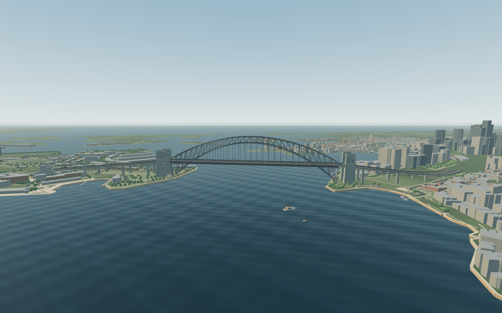
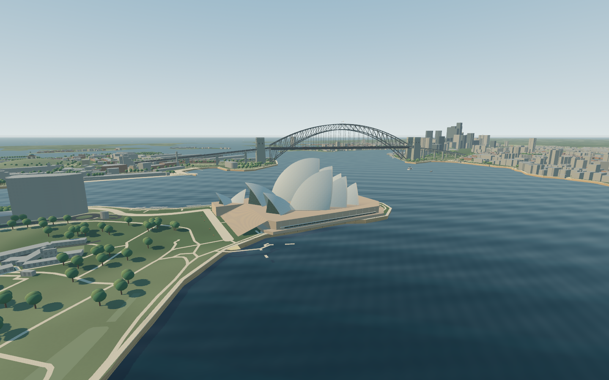
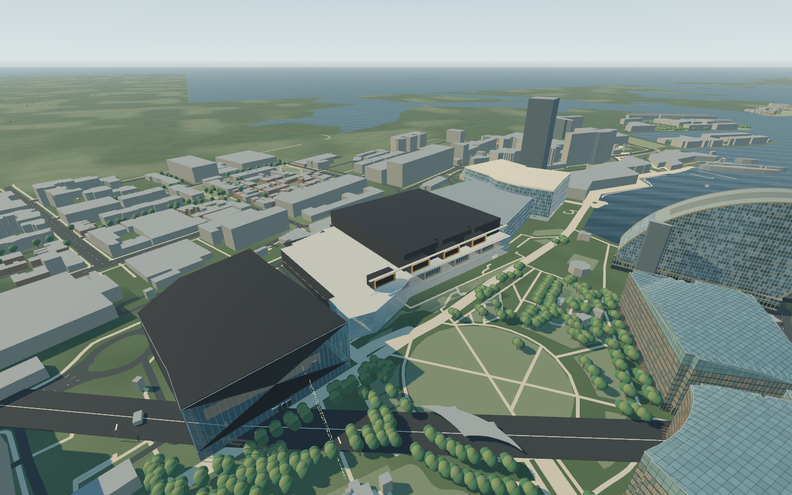
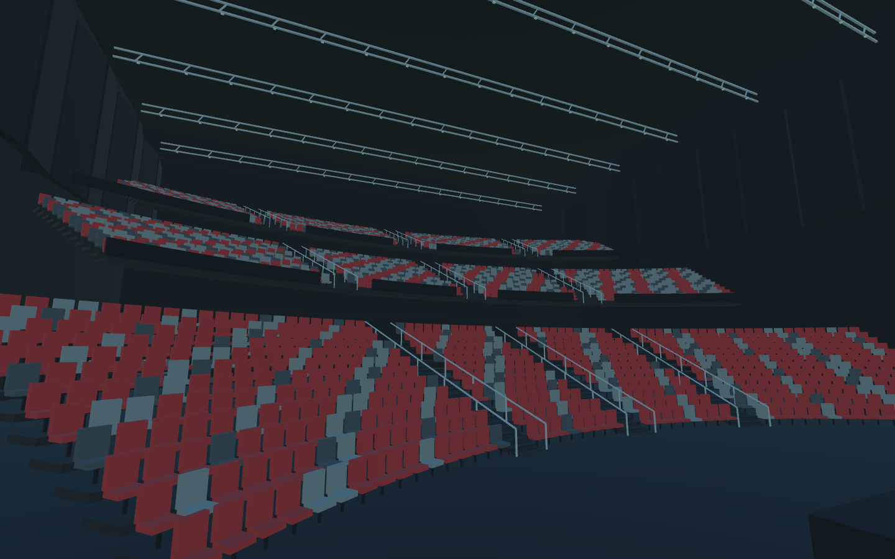
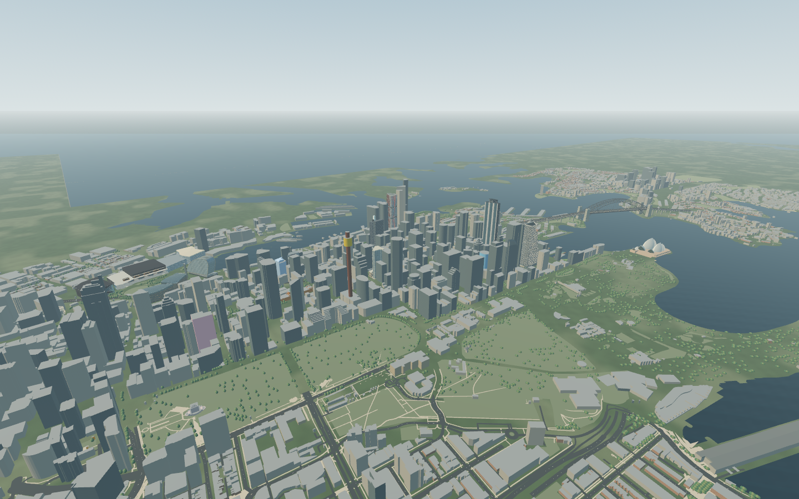
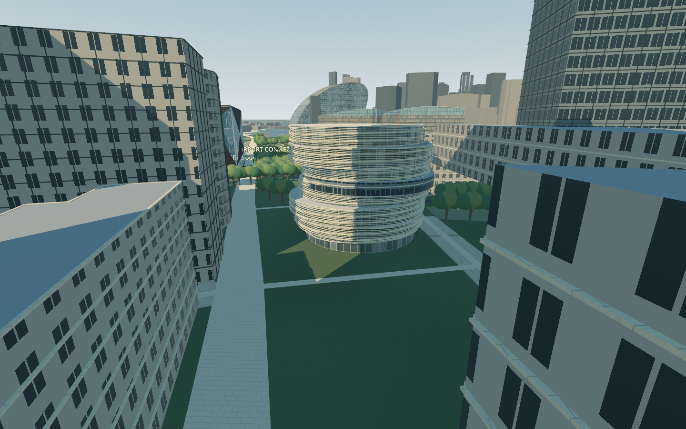
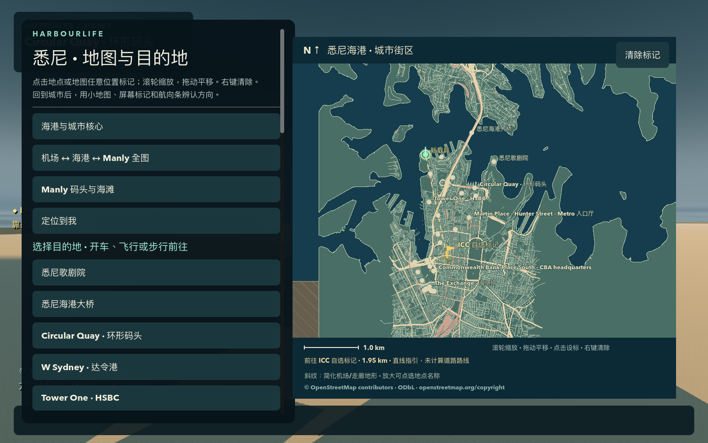
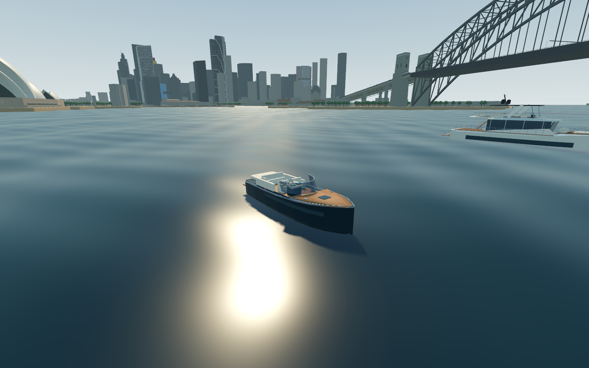

# Harbourlife · 悉尼海港

**v0.1.2-preview.1 · 自由探索与载具更新**

[下载 Mac 试玩包](https://github.com/YvesZhou-hub/harbourlife/releases/download/v0.1.2-preview.1/Harbourlife-macOS-arm64.zip) · [所有发布](https://github.com/YvesZhou-hub/harbourlife/releases) · [初版试飞短片](https://github.com/YvesZhou-hub/harbourlife/releases/download/v0.1.0-preview.1/flight-highlights.mp4)

免费的原生单人城市沙盒。从悉尼金斯福德机场起飞，飞向歌剧院和海港大桥；也可以步行、驾车、开船，探索 CBD、Darling Harbour、Darling Square 和 Manly。游戏离线运行，不需要账号或付费服务。

本轮加入免费新增载具并立即驾驶、常驻小地图与自由标点、轻松获得的旅行资金及城市体验，并按真实照片重新制作超跑、运动摩托、787 级客机、豪华快艇和游艇。大桥、歌剧院及城市目的地也校准了地图位置。详见 [更新说明](docs/FIXES_0.1.2.md)。公开下载包面向 **Apple Silicon Mac（M 系列芯片）**；目前验证环境为 Apple M4 / 16 GB / macOS 26.5，没有 Windows、Intel Mac 或浏览器玩家版本。

上方短片来自 **v0.1.0 初版预览**，不代表本轮更新后的城市画面或最终试飞验收。





## 下载后直接试飞

1. 从发布页面下载 `Harbourlife-macOS-arm64.zip`，解压得到 `Harbourlife.app`，双击打开。游玩不需要源码或 Godot 编辑器。
2. 标题页选择 **“从悉尼机场起飞”**，建立独立沙盒世界，从 **34L 跑道**进入客机。
3. 按住 **W** 加推力，约 **250 km/h** 时按 **R** 抬头；离地后松开，按需用 **R / F** 调整俯仰。
4. **A / D** 转弯，朝北偏东飞向海港；**M** 打开地图选择歌剧院或大桥，跟随距离和方向指引。**S** 减推力，落地后用空格制动。

这是辅助飞行游戏模型：客机需要前进速度，会失速，不能悬停。不要将游戏地图或操纵当作现实导航与驾驶依据。

发布包采用本地 ad-hoc 签名，未取得 Apple Developer ID 签名或公证。首次打开若被 macOS 阻止，请确认来自本仓库发布页面，再按 [Apple 官方说明](https://support.apple.com/en-au/102445)，在“系统设置 → 隐私与安全”中针对该应用选择“仍要打开”。GitHub 的 **Code → Download ZIP** 下载的是源码，不能直接当应用打开。


## 用 M 找城市里的地点

常驻小地图显示当前位置、朝向和目的地方向。按 M 打开大地图，可缩放、拖动，点击地点或任意空白处标点；右键或清除按钮取消。地图显示真实岸线、道路与建筑轮廓，导航同时提供屏幕标记、罗盘方向和距离，存档后保留目的地。可以选择机场、歌剧院、大桥、银行总部所在楼、Darling Square 店面、Manly 码头与海滩，以及已制作的地铁入口。

- **CBD 与海港：**HSBC 所在的 Tower One、中国银行 140 Sussex Street、Westpac Place、Commonwealth Bank Place South / North、Quay Quarter Tower 与 Salesforce Tower，均有单独制作的外观。
- **Darling Harbour / Darling Square：**W Sydney 的 Ribbon 楼体、The Exchange 与其 Level 5 海底捞位置；已列明的 12 家街边店面包含 Matcha-Ya、Nakano Darling、KUKI、Messina 等，逐店记录照片依据与仍属推断的细节。这一轮尚未完成 Darling Square 全部商户。
- **Manly：**真实街道与岸线、Manly Wharf、The Corso、Hotel Steyne 和海滩，可在地图中定位。
- **Metro：**Barangaroo 与 Martin Place 北入口包含街面门厅、下行扶梯和第一层地下落脚区，可实际走下去再返回街道。扶梯静止，没有列车或完整站台运营。

**新增办公楼与 ICC 场馆群：**CyberCX 的 2 Market Street、Cloudflare 的 388 George Street 已单独建模。ICC 的 Convention Centre、Exhibition Centre 与相邻 **TikTok Entertainment Centre** 分为三个独立场馆，可从街面进入已制作的大厅、展厅和观众厅，走上剧场舞台后返回。TikTok 在这里指演出场馆；楼层高差、座位数量及未公开空间仍有简化。[场馆资料与范围](docs/ICC_REFERENCE.md)











## 真实地图与建模精度

当前数据库包含 **15,508 个建筑轮廓或分体记录**；计数包括同一建筑的分体，普通街区使用地图轮廓和推断外立面。其中 524 条记录带已支持的坡屋顶类型，523 个在实际场景中生成，桥头保护区内另 1 个被排除；517 个屋顶升高仍需估算。已列明的地标、银行楼和店面另按真实照片单独制作。具体覆盖、记录数和参考资料统一见 [城市数据与精度](docs/CITY_DATA.md)。

位置、外形和高度分别记录来源。有公开高度时采用对应资料；仅有层数或照片时明确使用估算。大部分地面仍是平坦游戏基准，山坡、高架和地下网络尚未完整重建；机场至城区的中间地形也保留简化。本项目不声称已完成全悉尼一比一复刻或摄影测量扫描。

## 创造载具与其他玩法

按 **Tab** 选择车型，**每次点击免费新增独立副本并立即进入驾驶位**，之前的载具继续留在原地。不需要下车、找车或解锁。系统检查完整车身、机翼或船体，选择合理的道路、水面或机场位置；附近放不下客机时使用机场空闲位置。没有人为设定副本上限，实际数量受设备性能与可用空间影响。



八类载具包括超跑、运动摩托、豪华快艇、多层游艇、滑翔伞、滑翔机、直升机和大型双发客机。超跑参考 Revuelto，摩托参考 S 1000 RR，客机采用 787-9 的体量与主要特征，两种船分别参考 Rivamare 与 90 Ocean。模型包含轮胎轮毂、灯组、玻璃、发动机、甲板与座舱细节，采用原创程序化几何，不是厂商 CAD 或照片级扫描。[车辆和飞机参考](docs/VEHICLE_REFERENCE.md) · [船艇参考](docs/BOAT_REFERENCE.md)

两种模式都从 **$50,000** 开始。旧世界首次更新时仅补足不足部分，花掉后不会反复补款。摄影、回收、巡检、飞行观察和竞速均可重复，基础报酬 $1,500–3,000。**K** 打开城市体验：已制作店面的美食、ICC 场馆纪念体验和 Manly 野餐共 16 项，每次 $12–120，恢复耐力并保存旅行印章。这些是游戏消费反馈；目前没有实际电影播放、完整演出或全部商铺室内。[资金与体验说明](docs/PLAY_EXPERIENCE.md)

NPC 有行走、对话和危险躲避；局部建筑损伤同时改变画面与碰撞，并随世界保存。室内、活动和 NPC 内容仍有限，破坏系统不等同于现实建筑倒塌模拟。

## 操作

| 操作 | 按键 |
| --- | --- |
| 行走、油门与转向 | WASD / 方向键 |
| 观察 | 鼠标 |
| 奔跑 | Shift |
| 跳跃、载具制动 / 减速板 | 空格 |
| 交互、进入 / 离开载具 | E |
| 飞行俯仰、直升机升降 | R / F |
| 货物 | G |
| 工作与活动 | J |
| 城市体验、美食与旅行印章 | K |
| 免费新增载具、立即驾驶与维修 | Tab |
| 地图与目的地 | M |
| 保存截图 / 保存世界 | P / F5 |
| 暂停、设置、存档与恢复 | Esc |
| 角色返回个人空间 | Home |

## 存档与旧世界

存档位于本机 `~/Library/Application Support/Godot/app_userdata/Harbourlife · 悉尼海港/worlds/`。每个世界使用独立 JSON，保留前一次成功保存的 `.bak`；约每 60 秒自动保存，F5 手动保存，正常退出也会保存。截图存于同级 `photos/`，没有云存档。

存档格式 4 可读取旧格式 1 / 2 / 3，保存独立载具、导航目标和城市体验。较大的新船艇会检查旧泊位净空，必要时调整静止旧副本；原有 ID、油量和损伤保留，空中姿态与安全桥下停车不会被搬到另一层道路。旧世界首次进入本次地图时，会检查人物和已有载具是否被新建筑包住，只调整发生冲突的副本，保留 ID、油量、损伤与占用关系；之后正常保存记录地图版本。详见 [旧地图存档迁移](docs/SAVE_MAP_MIGRATION.md)。新版存档请继续用新版应用，旧应用会拒绝读取，避免丢掉独立副本。

## 验证与已知限制

最终发布构建、原生试玩、镜头跟随、静态渲染采样和试飞结果，以 [本轮验证记录](docs/TESTING.md) 对应的构建和证据为准。初版试飞视频及旧性能数据不作为这次城市扩展的通过证明。具体通过数量、启动方式和试飞范围列在验证记录中。

仅上述 Mac 配置有实测记录，其他设备表现未知。还没有多小时稳定性或完整硬件矩阵验证，不能保证所有场景稳定 60 FPS。游戏、美术、声音和生活内容仍是开发预览；商业推广所需的第三方地标形象等权利也尚未全部解决。

## 源码与本地构建

[仓库源码](https://github.com/YvesZhou-hub/harbourlife)保留程序化建模源资产、地图快照和验证脚本；本轮使用 `v0.1.2-preview.1` 标签对应的源码。

构建需要 macOS、Python 3，以及 [Godot 官方 4.7.2-stable 编辑器与 macOS 导出模板](https://github.com/godotengine/godot-builds/releases/tag/4.7.2-stable)。将编辑器应用内 `Contents/MacOS/Godot` 放为 `tools/runtime/godot`，导出模板 `macos.zip` 放为 `tools/runtime/templates/macos.zip`，保持两者版本一致，再运行：

```sh
chmod +x tools/runtime/godot
codesign --force --sign - tools/runtime/godot
./tools/build.sh
```

脚本使用本机暂存目录构建、ad-hoc 签名和启动检查，输出 `dist/Harbourlife-macOS-arm64.zip`。`dist/Harbourlife.app` 是本地生成应用的链接，分享请用 ZIP。地图的离线重建步骤见 [CITY_DATA.md](docs/CITY_DATA.md)，验证命令见 [TESTING.md](docs/TESTING.md)。

## 许可与来源

原创源码和资产保留权利，免费个人试玩范围见 [PLAY_PERMISSION.md](PLAY_PERMISSION.md)。公开源码不代表 MIT 授权，也不授予第三方地标的商业使用权。

Godot 适用 MIT，OSM 派生地理数据适用 ODbL，OurAirports 跑道数据为公共领域，各自条款独立。没有分发 Google 地图瓦片、街景照片或第三方城市模型。

[资产与依赖来源](licenses/ASSET_REGISTER.md) · [地理数据许可](licenses/GEOGRAPHY.md) · [城市精度与参考](docs/CITY_DATA.md) · [机场说明](reports/AIRPORT.md)

## English

Harbourlife is a free, offline, single-player Sydney sandbox for **Apple Silicon Mac**. Start on runway 34L at Sydney Airport, fly to the Opera House and Harbour Bridge, or explore the mapped CBD, Darling Harbour and Manly. Press **M** for destinations and **Tab** to create independent vehicle copies.

**v0.1.2-preview.1 · Free exploration and vehicle update.** Creating any of the eight vehicle classes is free and immediately seats the player. New worlds start with $50,000; optional city experiences, a persistent minimap and saved custom waypoints support exploration. Cars, motorcycles, the 787-size jet and two luxury boats use photo-referenced original geometry. The linked flight video shows the initial v0.1.0 preview. Real map footprints, individually photo-referenced landmarks and inferred building details have different accuracy levels; this is not a full 1:1 city scan. The app is ad-hoc signed and not notarized. Final build-specific results belong in [TESTING.md](docs/TESTING.md). See [play permission](PLAY_PERMISSION.md) and the separate data/dependency licences.
