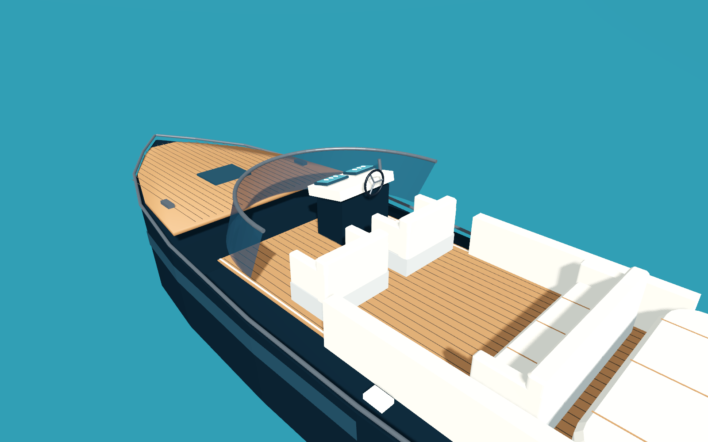
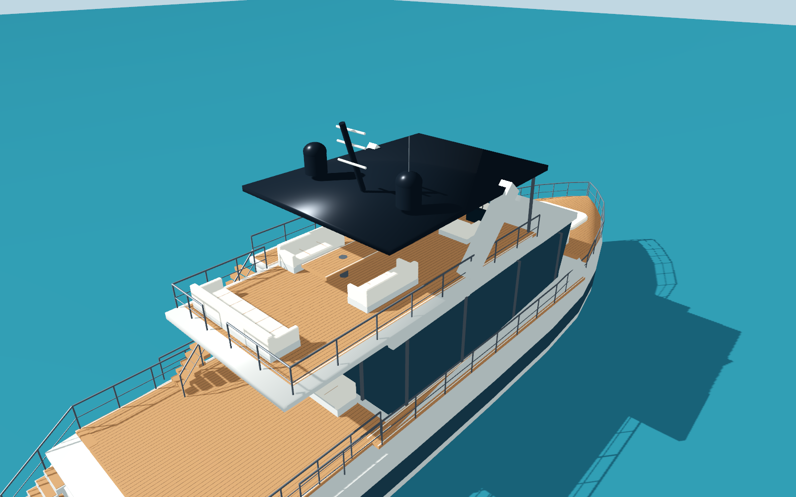

# 两艘船的实物参考与实现范围

模型由程序生成原生网格，没有导入厂商模型、参考照片或第三方纹理。建模前实际浏览了下面两家厂商的产品照片：Rivamare 艏部斜侧照片、90 Ocean 侧面照片和艉部斜侧照片。照片用于核对轮廓、材料分区和露天甲板布局，项目不分发这些参考像素。

| 游戏类型 | 官方参考 | 总长 | 最大船宽 | 官方吃水 |
| --- | --- | --- | --- | --- |
| `speedboat` 豪华快艇 | [Riva Rivamare](https://www.riva-yacht.com/en-us/Model/p/2-152-252-PUB/n/Riva-Rivamare) | 11.88 m | 3.50 m | 1.20 m |
| `yacht` 多层游艇 | [Sunseeker 90 Ocean](https://www.sunseeker.com/range/90-ocean) | 27.10 m | 7.16 m | 1.94 m |

采用的是开放飞桥的 90 Ocean，不能与另一款 Ocean 90 Enclosed 的封闭上层混称。官方长度、船宽、吃水用于米制外包络；船壳各截面、甲板标高、座椅数量和楼梯尺寸根据照片推估，并为游戏中的人员与货物通行调整。它们不是造船厂 CAD、完整舱室复刻或工程水动力模拟。

Rivamare 模型包含深蓝色闭合 V 形船壳、细长柚木前甲板、后倾弧面风挡、镀铬压条、侧窗、开放双座驾驶区、双屏仪表、三辐方向盘、油门杆、软垫后座与日光浴垫、艉部低游泳平台、通风百叶和航行灯。风挡采用双面玻璃，驾驶区从前后视角都可见。

90 Ocean 模型包含宽艏船壳、连续侧窗与斜向白色侧板、主层玻璃围护、艏部休息区、艉部柚木甲板、两侧下至游泳平台的楼梯，以及通向开放飞桥的独立楼梯。飞桥有真实甲板开口、驾驶台、餐桌、座椅、栏杆、后倾支架、深色顶棚、雷达罩与桅杆。封闭沙龙和下层客舱没有制作可进入的室内。

几何实现在 [boat_models.gd](../game/scripts/boat_models.gd)。静态装饰按材料合批；所有碰撞形状都是船体的直接子节点。闭合船壳用于实体碰撞，浮力由游戏的四点弹簧模型控制。碰撞地板独立于木纹接缝；飞桥楼梯上方保留真实开口，艉部楼梯有连续斜面接触，避免细小踏步导致接触抖动。

## 物理接口

统一局部前方为 `-Z`、上方为 `+Y`。静止时船体原点世界高度 `0.9 m`，局部水线为 `Y=-0.9 m`。`boat_profile.camera_height` 是镜头注视点相对船体原点的高度；它不是最终镜头的海拔。

| 参数 | 快艇 | 游艇 |
| --- | --- | --- |
| 浮力点左右 / 前后半间距 | 1.10 / 3.60 m | 2.35 / 8.20 m |
| 尾流局部 Z | 5.55 m | 13.50 m |
| 下船平台局部点 | `(0, 0.15, 5.53)` | `(0, 0.16, 12.65)` |
| 跟随距离 / 注视高度 | 18.0 / 1.1 m | 39.0 / 3.8 m |
| 小货物放置点 | `(0, 0.49, 1.6)` | `(0.35, 1.49, 8.55)` |

游艇艉部主甲板顶面为 `Y=1.46 m`，范围 `X=-3.15..3.15`、`Z=4.68..10.68`。为保留物理运车玩法，艉部中后段保留平坦空区，外侧上楼梯位于左舷前段。约 5 m 长、2.27 m 宽的跑车可在 `(0, 1.46, 9.1)` 横放，朝向 `PI/2`；车轮和车身下方均有连续甲板支持，顶部不碰飞桥底板。该安排是游戏适配，不表示真实游艇获准承载汽车。

## 验证

[boat_model_test.gd](../source/boat_model_test.gd) 从生产 `vehicle_factory` 创建两艇，检查闭合壳体的边配对、正体积与外法线，官方尺寸、水线与吃水、直接凸碰撞、材质合批、下船平台支持、横放跑车的九点支撑与净空，以及飞桥楼梯的净高和两侧艉梯连续接触。

最终局部 headless 为 41 项通过；原生 Metal 运行同样检查并捕捉七个视角，共 48 项通过。七图实际查看，包含两船艏艉、快艇驾驶区、游艇飞桥与运车甲板。局部测试使用简单水面和照明，不能代替完整城市中的实际操纵验证。全载具运输与操纵回归由 [test_vehicles.gd](../tools/test_vehicles.gd) 单独执行；总体交付结果以 [TESTING.md](TESTING.md) 为准。

## 原生局部模型截图

以下为简单水面与照明测试场景的真实截图，不是完整城市视角。

