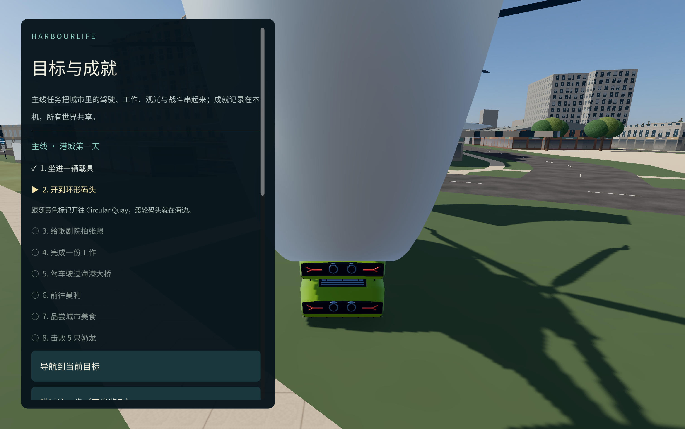

# v0.3.0-preview.1：主线目标、手柄与设置、画面翻新、更快加载

这一版的重点是把沙盒打磨得更像一款完整的 PC 游戏：进游戏有明确目标，界面和设置齐全，支持手柄，城市画面更自然，加载更快且不再“卡死”。存档格式仍为 7，旧世界可以直接继续。

## 玩法与目标

- **主线第一章“港城第一天”**：新世界自动开始，8 个步骤把已有玩法串起来：上车、开到环形码头、给歌剧院拍照、完成一份工作、驾车过海港大桥、飞或开船去曼利、品尝城市美食、击败 5 只奶龙。每步自动导航并发奖励，整章完成再奖 $20,000。
- 左侧目标卡片显示当前目标、说明和距离；**Esc → 目标与成就**可以查看进度、导航、跳过、隐藏追踪或重新开始本章（已领奖励不会重复发放）。
- **15 个成就**，保存在本机、所有世界共享，例如时速 300、突破音障、客机起飞、到访六大地标。
- 旧世界读取后从第一章开头开始，不影响原有财富、载具和进度。

详见 [主线与成就](CAMPAIGN_AND_ACHIEVEMENTS.md)。

## 界面、设置与手柄

- **HUD 重新排版**：16:9、16:10（Steam Deck）、21:9 都铺满画面、不再有黑边；左侧状态、目标、提示和生存卡片自动上下排列，互不遮挡。设置了目的地时，左下角导航文字不再被底部提示挡住。
- **完整设置菜单**：显示模式（窗口 / 无边框全屏 / 独占全屏）、垂直同步、帧率上限、渲染分辨率（FSR 1 放大）、抗锯齿（FXAA / MSAA / TAA）、视野、音量、灵敏度、切到后台静音。
- **手柄支持**（Xbox 布局，PlayStation、Switch Pro、Steam Deck 按对应位置）：摇杆移动和视角，菜单可用十字键 / 摇杆选择、A 确认、B 返回；使用手柄时底部提示自动切换为手柄按键。暂停菜单新增“拍照”，方便手柄拍照。
- **键盘改键**：每个动作都可以重新绑定，冲突时提示；底部提示、载具说明、生存卡片、小地图和目标说明都会显示你当前的按键。

详见 [设置、手柄与界面](SETTINGS_AND_CONTROLS.md)。

## 画面

- 光照改用更自然的色调映射，修正整体偏蓝和过曝，白天暖、夜晚冷。
- 普通楼房增加临街店面（橱窗、招牌、卷帘门）、每栋楼不同的色调、楼板线、窗台、雨水痕迹和窗内陈设，夜间店铺亮灯。
- 树冠、草坪和路面加入细节纹理，树叶有透光感。

详见 [渲染说明](RENDERING.md)。

## 性能

- 启动加载在 Apple M4 上从上一版的约 74 秒降到约 13 秒（源码实测，完整城市）。
- **加载界面有进度条和当前阶段**，加载过程中窗口持续响应，不会再出现“未响应”或转圈光标。
- 城市网格合并后上传的顶点减少约 17%；碰撞体与画面保持逐位一致。

详见 [运行性能](PERFORMANCE.md)。

## 兼容与已知限制

- 存档格式仍为 7。新版世界可以在 v0.2.2 打开，但在旧版里保存会丢掉主线进度。
- 成就目前只保存在本机，没有接入任何平台账号。
- Mac 包为 ad-hoc 签名、未公证；Windows 包未签名。Windows 自动验收使用无界面模式，不代表已实测 Windows 显卡画面、声音或真实手柄。
- 手柄支持按 Godot 的标准手柄映射实现，尚未在实体手柄和 Steam Deck 上实测。
- 城市仍没有车流和行人；远处夜景偏亮；这些是预览版后续工作。

实际验证结果见 [验证记录](TESTING.md)。
