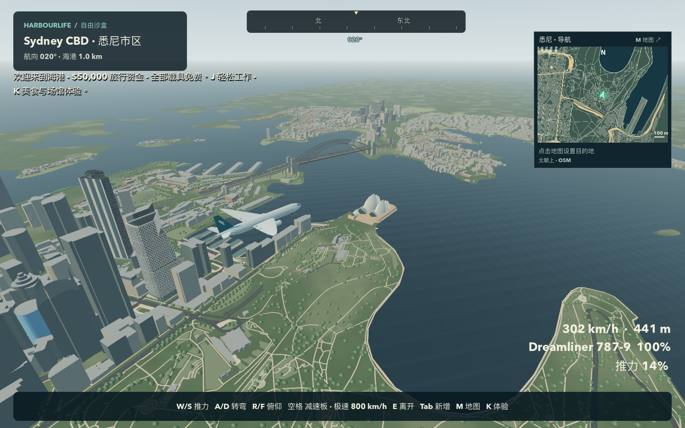
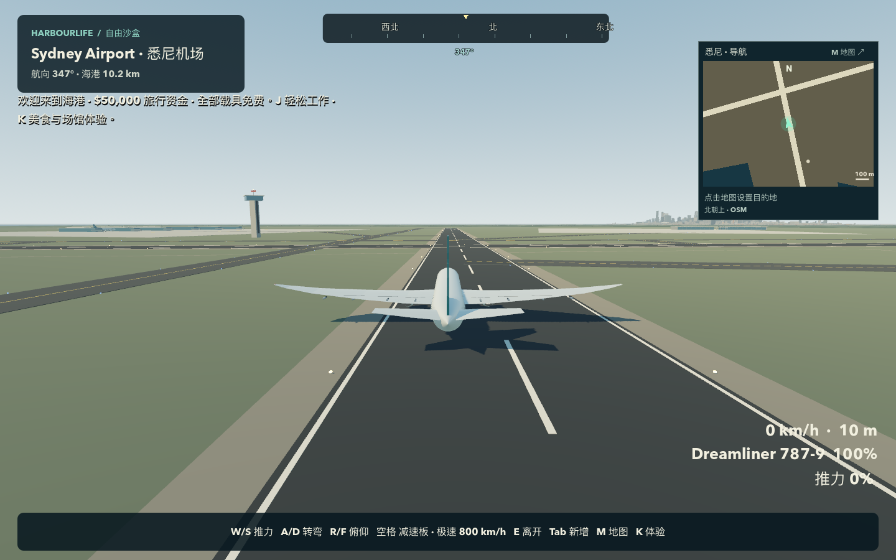

# v0.1.3-preview.1 验证记录

本轮在 Apple M4 / 16 GB、macOS 26.5、Godot 4.7.2、Metal / Forward+ 和 Jolt 上开发与验证。公开玩家构建为 Apple Silicon Mac 原生离线应用。其他平台未提供已验收的玩家包；[v0.1.2 记录](TESTING_0.1.2.md)独立保留。

## 最终下载包

`Harbourlife-macOS-arm64.zip` 的 SHA-256 为：

```text
39ab7826e8b4e251a714b2293250195c69732f1ba2253d58fc87e779ff26241c
```

[构建清单](evidence/v013-app/build.json)记录 106 个游戏源文件散列。[独立 ZIP 验收](evidence/v013-app/archive-validation.json)的 13 项检查全部通过：CRC、全新解压、arm64、0.1.3 版本、0755 执行权限、严格 ad-hoc 签名、PCK 与 17 个资源加载，包含实际读取存档 `VERSION = 5`。从 `/tmp` 新解压的 App 在 21.4 秒进入完整世界 READY，生成 15,127 个建筑节点和 21,302 个结构组件，正常退出且没有脚本错误。该启动时间仅属于此机器和该次 headless 检查。

最终包通过以下原生应用内验证；均重新启动该 App，检查输出时间，正常退出，没有记录到运行时 ERROR / WARNING：

| 流程 | 通过检查 | 启动记录 | 原始结果 |
|---|---:|---|---|
| 玩家体验、九类载具创建入座、地图、22 项消费与保存加载 | 70 | [experience-launch.json](evidence/v013-app/experience-launch.json) | [experience-report.json](evidence/v013-app/experience-report.json) |
| 滑翔机、滑翔伞创建初速与空中保存加载 | 16 | [air-vehicle-launch.json](evidence/v013-app/air-vehicle-launch.json) | [air-vehicle-report.json](evidence/v013-app/air-vehicle-report.json) |
| 全城基础流程、九类载具移动、破坏与持久化 | 32 | [qa-launch.json](evidence/v013-app/qa-launch.json) | [qa-report.json](evidence/v013-app/qa-report.json) |

合计 118 项；这些测试有覆盖重叠，不代表 118 个独立功能。

## 场景画面与完整机场航线

完整场景截图、悬浮物理与机场往返使用此前同轮候选 App，SHA-256 `18450e59ddfe399654322e62d28e5544831448ec23cf6af3ddbf0e94df96162c`。发布前存档审查发现旧版会忽略新滑板，最终包因此仅将 `save_store.gd` 的格式常量从 4 改为 5，阻止旧版读后保存丢失新类型。

[逐文件比较](evidence/v013-app/build-comparison.json)和[候选构建清单](evidence/v013-app/candidate-build.json)确认：106 个游戏文件中 105 个完全相同，唯一差异是上述常量；城市、载具、物理、地图、相机和试飞代码均未改变。与保存加载有关的原生流程已在最终包重新运行。以下结果保留原构建归属，没有改称为新 ZIP 的重复实测。

| 验证 | 结果 | 证据 |
|---|---|---|
| 完整城市场景与载具画面 | 31 张新鲜原生截图，31 项保存/世界就绪检查通过 | [启动](evidence/v013-app/candidate-visual-launch.json) · [捕获记录](evidence/v013-app/candidate-visual-report.json) |
| 悬浮板实体移动 | 12 项通过：200 km/h、24 级实体楼梯、水面、升高后悬停和墙前制动 | [启动](evidence/v013-app/candidate-mobility-launch.json) · [结果](evidence/v013-app/candidate-mobility-report.json) |
| 机场 → 歌剧院 → 海港大桥 → 机场 | 45.449 km、565.317 模拟秒、全程血量 100、零碰撞事件，返航后低于 0.20 m/s 停车门槛 | [启动](evidence/v013-app/candidate-flight-launch.json) · [完整航线结果](evidence/v013-app/candidate-flight-report.json) |

试飞经过 33,919 个有效物理帧；共记录 33,967 个原生绘制帧。起飞滑跑约 872m，最高高度约 443m，距歌剧院最近约 487m、距大桥约 1,017m。停机坪与所有七个飞行阶段的截图分别保存；原始报告中的 `parked_speed_mps` 是起飞前静置速度，不是返航终速。飞机在标准机场开始动作之后，只通过生产输入动作控制，没有通过改位置或速度完成航线；拍摄地标时仅调整文档相机。





[截图索引](evidence/v013-app/screenshots.json)记录 44 张公开 PNG 的散列和来源构建，其中最新的四张地图/消费界面图来自最终格式 5 包。31 张场景图已逐张复看：城市 17 张、载具 9 张、大桥/歌剧院 5 张。七张飞行阶段也已查看。图像没有修饰或合成；[城市复核](evidence/v013-app/city-visual-review.json)、[载具复核](evidence/v013-app/vehicles-visual-review.json)与[大桥/歌剧院及航线复核](evidence/v013-app/landmark-flight-visual-review.json)记录观察与限制。截图捕获通过本身不等于视觉质量自动通过。

## 城市、存档与组件

[组件证据索引](evidence/v013/index.md)共列出 19 组、603 项通过检查，区分原始 JSON、实际日志摘要、局部几何、完整世界和原生局部场景。它们可能覆盖相同行为，不能当成 603 个独立功能，也不能冒充最终下载包验收。

- 三种航空模型 18 项，实际车辆加速/转向/制动 16 项，悬浮板 12 项。
- 地图迁移 52 项，载具模型迁移 24 项；检查新塔、码头、广场实体、损毁洞口、公共入口和重定位后的首帧速度。
- 默认九类载具各静置六秒，均满血且没有碰撞伤害；停机坪与默认 787 净空另有 16 项检查。
- W 及同模块地标 23 项、ICC 30 项、悉尼塔 19 项、环形码头和达令广场 72 项。
- 底座导入规则 12 项、实际底座和 15 家店面的通行 28 项；只保留地图高度标签明确的 21 个底座。
- 道路连接 17 项、生活经济 40 项、完整世界载具创建与恢复 83 项、完整城市对齐 96 项。
- 存档格式 5 的 20 项回归使用实际 v0.1.2 reader，验证旧版拒绝新版且不修改文件；新版接受格式 1–4，升级时保留原车、两个独立滑板、占用关系与原始恢复副本。

地理检查核对 35 个轮廓与 35 个公共到达点，采用原始 OSM 投影和实际物理净空。同源轮廓最大差约 0.00069m，只说明程序转换一致，不能作为现实测绘精度。

## 验证边界

本次 Mac 处于锁屏状态，桌面控制工具报告无法获取原生应用；没有改变锁屏或安全设置。生产 UI 按钮、输入动作、物理与存档由原生应用内的隔离验证器运行，OS 层键盘鼠标人工走查未实测。固定步长试飞和锁屏时帧间隔不代表正常前台 FPS；没有多小时稳定性或跨硬件矩阵测试。静态截图也不能证明行驶中所有镜头都无抖动。

城市仍为有资料依据的程序化重建。普通外立面、很多高度、地形、高架、地下网络和私有室内未逐一复刻。W / ICC / Sydney Tower、15 家 Darling Square 店面、3 家 Circular Quay 店面和所列公共区域的具体范围见各参考文档。W 周边部分地面和远景仍简化；细化店面主要是外观与门前公共空间。游戏服务不是现实订票、菜单或营业状态。

原生验证使用带 QA 标识的独立世界，不读取、覆盖或删除玩家已有世界；测试存档及备份保留。可播放应用和公开源码 ZIP 是不同资产。源码包不包含编辑器、导出模板、用户存档、私人文件或外部照片。

## 复现

从项目根目录运行，Godot 官方编辑器和匹配的 macOS 导出模板安装方法见 README：

```sh
python3 source/city_parent_policy_test.py
./tools/runtime/godot --headless --path game --script ../tools/test_save.gd
./tools/runtime/godot --headless --path game --script ../source/vehicle_spawn_test.gd
./tools/runtime/godot --headless --path game --script ../source/map_migration_test.gd
./tools/runtime/godot --headless --path game --script ../source/city_parent_base_test.gd
./tools/runtime/godot --headless --path game --script ../source/precinct_detail_test.gd
./tools/runtime/godot --headless --path game --script ../source/landmark_alignment_test.gd
./tools/build.sh
python3 tools/verify_native.py experience
python3 tools/verify_native.py visual
python3 tools/verify_native.py qa
python3 tools/verify_native.py mobility
python3 tools/verify_native.py air-vehicle
python3 tools/verify_native.py flight
```

需要有图形会话的原生模式按顺序运行。无界面组件检查与导出 App 自动化、OS 层人工试玩是不同验证层次。
