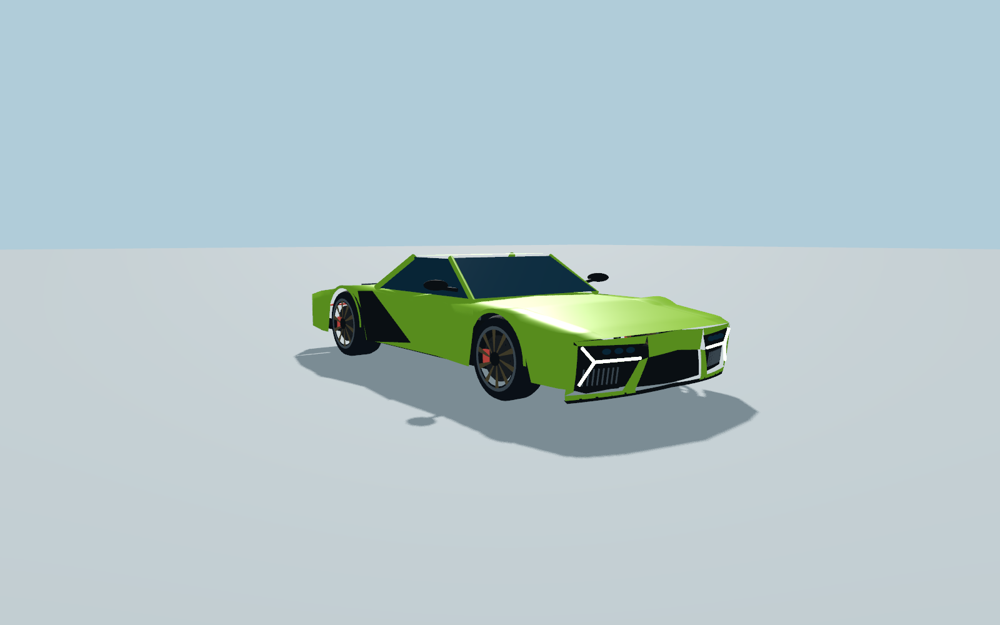
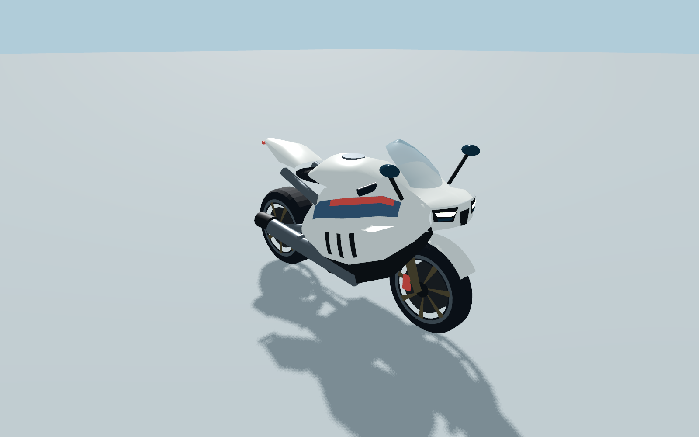
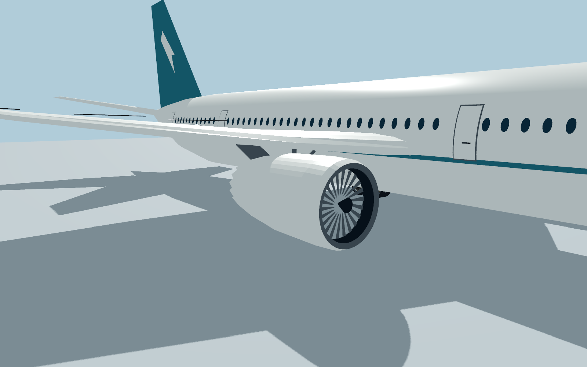

# Vehicle shape references and reconstruction boundaries

Checked 11 September 2026. The car, superbike and widebody are original procedural game meshes reconstructed from manufacturer dimensions and inspected official images. They contain no downloaded photograph textures, vendor CAD, licensed model files or copied badge artwork. Factory save keys remain `car`, `motorcycle` and `airliner`; rendering uses the new `vehicle_refinement.gd` module. Handling remains the game's accessible physics rather than a manufacturer-certified simulation.

## Car: Lamborghini Revuelto proportions

The manufacturer's [2024 digital brochure](https://www.lamborghini.com/original/DAM/lamborghini/facelift_2019/model_detail/revuelto/2024/brochure/07_23/REVUELTO_DIGITAL_BROCHURE_EN_2024.pdf) gives length 4.947 m, body width 2.033 m, mirror width 2.266 m, height 1.160 m, wheelbase 2.779 m, front track 1.720 m and rear track 1.701 m. The manufacturer's [model page](https://www.lamborghini.com/en-en/models/revuelto-models/revuelto) and [official pre-owned model gallery](https://preowned.lamborghini.com/en_gb/models/revuelto) support the exterior composition.

Actually viewed the gallery's green front three-quarter photograph and orange rear/exhaust close-up. The reconstruction uses a low wedge, creased bonnet, raised wheel shoulders with open tyre wells, low tapered cabin, large dark side intakes, three-branch lamps, raised twin exhausts, rear diffuser, and open-spoke wheels with visible brakes. The final front geometry uses tyre-sized arch clearance, continuous shoulder/bonnet normals, a bumper wrapping back around both front corners, separate recessed lamp and intake chambers, green dividing vanes, three projector lenses per side and continuous three-branch LEDs. This replaces the earlier tall wheel humps and flat black front face. Rear exhaust mouths sit outside the fascia. Individual panel curvature and the simplified cabin are visual estimates, not body-scan geometry. The game uses its own paint and markings.

## Motorcycle: BMW S 1000 RR proportions

[BMW Motorrad technical data](https://www.bmw-motorrad.co.uk/en/models/sport/s1000rr/technicaldata.html) gives length 2.073 m, mirror width 0.848 m, unladen height 1.205 m, wheelbase 1.457 m, seat height 0.832 m, 17-inch wheels and 120/70 front / 190/55 rear tyres. The [official model page](https://www.bmw-motorrad.co.uk/en/models/sport/s1000rr.html) supplied the actual white/blue/red front three-quarter image and the close-up of the side fairing and aerodynamic winglet, both inspected in the browser.

The model has a sculpted fuel tank, a rounded transparent swept windscreen attached to a continuous nose brow, two independent angular LED lamps, a central air intake, compound-curved sport fairings, three side gill openings, winglets, front mudguard, short raised tail, upside-down forks, swingarm, chain, low exhaust, connected mirror stalks and separate tyre/rim/brake geometry. Livery is subdivided onto the fairing at its exact profile stations so it does not disappear into the curved body. The fairing and accessories are estimated from images; the rider is a generic game character with a corrected seat position. The observed gallery includes current model-year and option variations, so this is not a claim that every production trim is identical.

## Aircraft: Boeing 787-9 proportions

[Boeing's 787 specifications and gallery](https://www.boeing.com/commercial/787) gives the 787-9's 62.8 m length, 60.1 m span and 17.0 m height. The official gallery image of the three-aircraft family in flight was inspected for the curved nose, cockpit glazing, long flexible wing, raked tip, underwing engines and swept tail. It is a family reference, not a guarantee that all three aircraft pictured are 787-9s.

The model uses a variable-section fuselage, six projected cockpit panes, oval passenger windows, four pairs of curved door outlines, airfoil-section swept wings with continuously rising tips, separate horizontal and vertical stabilisers, two open-inlet nacelles, 18 trailing chevrons per nacelle, 22 animated fan blades per engine, and ten extended landing-gear tyres. It has no false upright winglets. Exact airfoil sections, static flex, gear attachment locations and nacelle dimensions are estimates; there is no retractable gear or cabin interior in this asset. Its livery is original. Large cockpit and door faces are subdivided onto the curved skin so they remain visible instead of sinking into a flat chord through the fuselage.

## Coordinate and collision contract

All values below are local metres; forward is −Z and up is +Y. The body origin retains the old tyre contact height, avoiding a vertical relocation solely because the mesh changed. Direct rigid-body shapes remain suitable for vehicle collision and safe-spawn footprint inspection. The renderer merges static detail by material while preserving wheel and fan pivots.

| Model | Visible bounds, including trim (X × Y × Z) | Lowest tyre / collider Y | Wheel locations |
|---|---|---:|---|
| Car | about 2.264 × 1.160 × 4.967 m | −0.680 | front X ±0.860, Y −0.329, Z −1.430, radius 0.351; rear X ±0.8505, Y −0.3095, Z 1.349, radius 0.3705 |
| Motorcycle, rider hidden | about 0.847 × 1.205 × 2.077 m | −0.720 | X 0; front Y −0.420, Z −0.7285, radius 0.300; rear Y −0.400, Z 0.7285, radius 0.320 |
| 787-9 | 60.100 × 17.000 × 62.800 m | −4.240 | eight main tyres: X ±3.120 / ±3.700, Y −3.630, Z 1.000 / 2.450, radius 0.610; two nose tyres X ±0.290, Y −3.790, Z −23.100, radius 0.450 |

The car's thin lighting/trim adds approximately 20 mm to the nominal body length. Tyre approximation adds 4 mm to the bike length. Motorcycle rider anchor is `(0, 0.12, 0.40)`. Aircraft nose tyres deliberately share the main gear contact plane; they no longer hover higher than the main gear.

## Validation

`source/vehicle_model_test.gd` builds only the three local assets and checks **33 assertions**, including finite vertices, valid indices, outward winding, measured proportions, contact planes, correct animated wheel/fan counts, stable chassis transforms and bounded render budgets. It also supports `-- --visual` for reproducible model-only native screenshots. Headless evidence: `reports/vehicle-model-test.log`.

Current geometry totals after visual seam corrections: car **26,512 triangles / 30 meshes / 6 direct colliders**, motorcycle **19,164 triangles / 23 visible meshes / 3 direct colliders** (rider hidden), aircraft **43,460 triangles / 73 meshes / 18 direct colliders**. Factory batching preserves the detailed meshes without one draw call per panel. Full-world summoning, movement, persistence and release tests are tracked by the integration suite separately from this local geometry fixture.

Final local checks: **33/33 headless and 33/33 native pass**, with no script errors. Eleven 1600 × 1000 Metal screenshots were captured. Visual inspection includes original-height and low front views plus rear three-quarter views of both road vehicles, motorcycle side, aircraft front/rear, engine and cockpit; the aircraft geometry remained unchanged during the final road-vehicle refinement. These views exposed and drove corrections to wheel shoulders, light occlusion, bumper shape, fairing seams and windscreen shape. Final repeat evidence is `reports/vehicle-model-native.log`; images are under `reports/vehicle-refinement/`. These are intentionally stylised procedural reconstructions, not photoreal vehicle scans.

## Native model close-ups

These are the actual local model fixture renders, with simple test lighting and no city scene.

